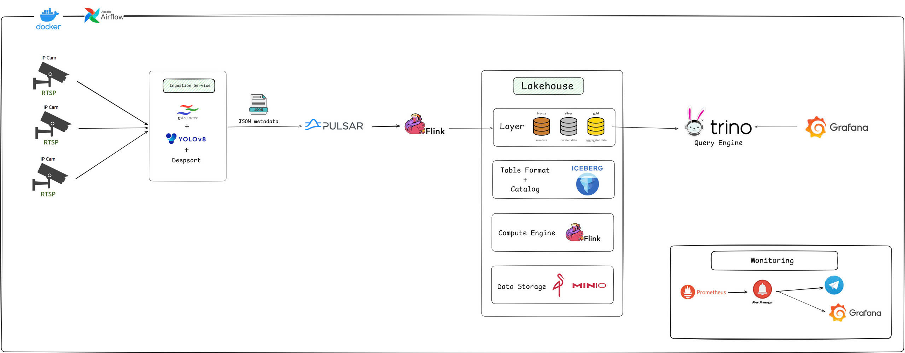

# Retail Video Analytics (Lakehouse, Realtime)

> Realtime pipeline thu thập & xử lý **metadata video** cho chuỗi bán lẻ.
> Stack: **GStreamer + YOLOv8 + DeepSort → Pulsar → Flink → Iceberg (REST Catalog) on MinIO → Trino → Grafana**
> Monitoring: **Prometheus + Alertmanager (+ Telegram) + Grafana**
> Orchestration (optional): **Airflow** cho maintenance/batch.



## 🎯 Mục tiêu

* **Latency E2E**: ≤ 3–5s (từ khung hình → biểu đồ).
* **Throughput**: 50–200 msg/s (tùy số camera demo).
* **Exactly-once** vào Lakehouse; **replay** không mất dữ liệu.
* Dữ liệu mở: **Parquet + Iceberg** (ACID, time-travel, schema/partition evolution).

---

## 📦 Thành phần chính

* **Ingestion Service**: `gstreamer + yolo v8 + deepsort` → phát hiện & tracking, xuất **JSON metadata** (không đẩy khung hình).
* **Transport**: **Apache Pulsar** (`Key_Shared` theo `camera_id`, schema Avro/JSON, tiered storage → MinIO).
* **Stream Compute**: **Apache Flink** (event-time, watermark, CEP, exactly-once sink).
* **Lakehouse**: **Apache Iceberg** (table format) + **REST Catalog** (backend JDBC) trên **MinIO** (warehouse).
* **Query**: **Trino** (Iceberg connector).
* **Visualization**: **Grafana** (BI near-real-time qua Trino).
* **Monitoring**: **Prometheus + Alertmanager (+ Telegram)**, **Grafana** dashboards.
* **(Optional)** **Airflow**: chạy maintenance/batch/quality (expire snapshots, compaction, export).

---

## 🗂 Cấu trúc thư mục (đề xuất)

```
.
├─ docker/                # compose, configs của services
│  ├─ pulsar/
│  ├─ flink/
│  ├─ iceberg-rest/       # REST Catalog + JDBC backend (Postgres)
│  ├─ trino/
│  ├─ minio/
│  ├─ prometheus/
│  ├─ grafana/
│  └─ airflow/
├─ ingestion/             # gstreamer + yolo + deepsort producer (Python)
├─ flink-jobs/            # SQL/JAR cho Bronze→Silver→Gold
├─ sql/                   # DDL Iceberg, Trino samples
├─ dashboards/            # Grafana JSON
├─ docs/                  # hình kiến trúc, tài liệu
└─ README.md
```

---

## ⚙️ Yêu cầu

* Docker & Docker Compose
* GPU (tùy chọn) cho YOLOv8; CPU vẫn chạy được với model nhỏ
* Cổng mặc định (có thể đổi trong `.env`):

  * MinIO: `9000/9001`, Trino: `8080`, Pulsar: `6650/8080`, Prometheus: `9090`, Grafana: `3000`, Iceberg REST: `8181`, Airflow Web: `8088`

---

## 📚 Tài liệu chi tiết

- 📄 **Project Doc (Google Drive)**: [Tài liệu Retail Video Analytics](https://drive.google.com/drive/folders/15HIuR8GIeGHsRPt7F2PeaChrG9XlMYoa?usp=sharing)


---

## 👥 Contributors
- [Nguyễn Tấn Hùng](https://github.com/hungfnguyen)
- [Nguyễn Công Đôn](https://github.com/CongDon1207)

