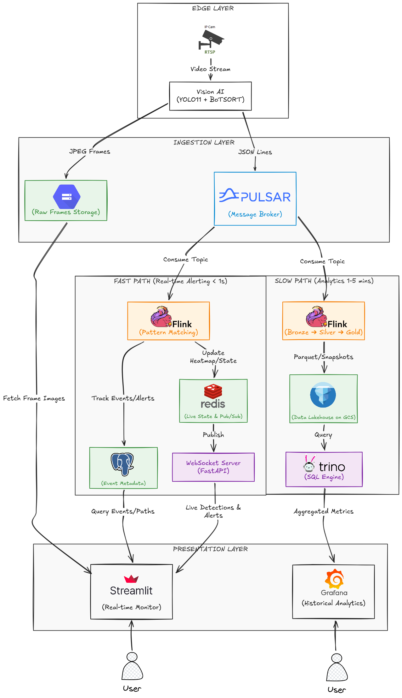
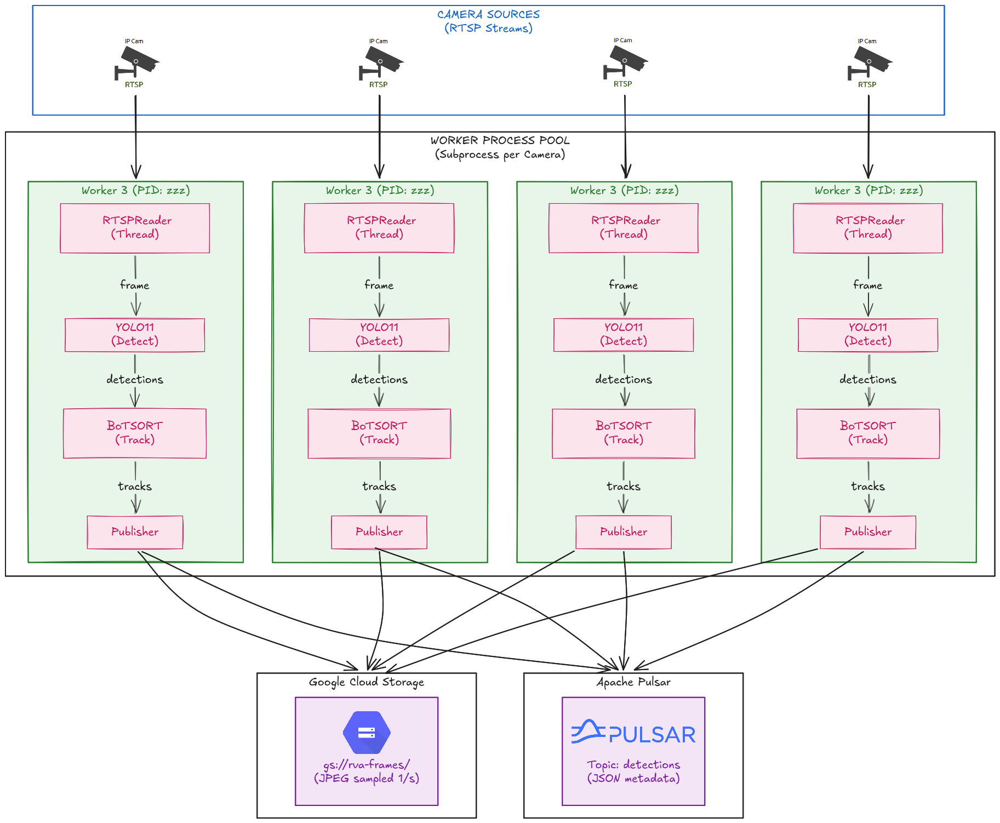

# Retail Video Analytics

Real-time people detection, tracking, and crowd density analysis for retail stores.

## What It Does

- Detects and tracks people in camera feeds using **YOLO11 + BoTSORT**
- Renders a **live heatmap overlay** directly on video to show crowd density
- Triggers **real-time alerts** (< 1 second) when crowd density exceeds thresholds
- Stores **historical analytics** in a Medallion Lakehouse for trend analysis

## Architecture

## Multi-Camera Processing Architecture

## Tech Stack

| Component | Technology |
|-----------|-----------|
| Vision AI | YOLO11 + BoTSORT |
| Message Broker | Apache Pulsar 3.3.2 |
| Stream Processing | Apache Flink 1.18 |
| Lakehouse | Apache Iceberg + GCS |
| Query Engine | Trino 418 |
| Real-time State | Redis |
| Metadata DB | PostgreSQL 16 |
| Dashboards | Streamlit + Grafana 11.3 |

## Services

| Service | URL |
|---------|-----|
| Streamlit Dashboard | http://localhost:8501 |
| Grafana | http://localhost:3000 |
| Flink UI | http://localhost:8081 |
| Pulsar Admin | http://localhost:8084 |
| GCS Console | https://console.cloud.google.com/storage |