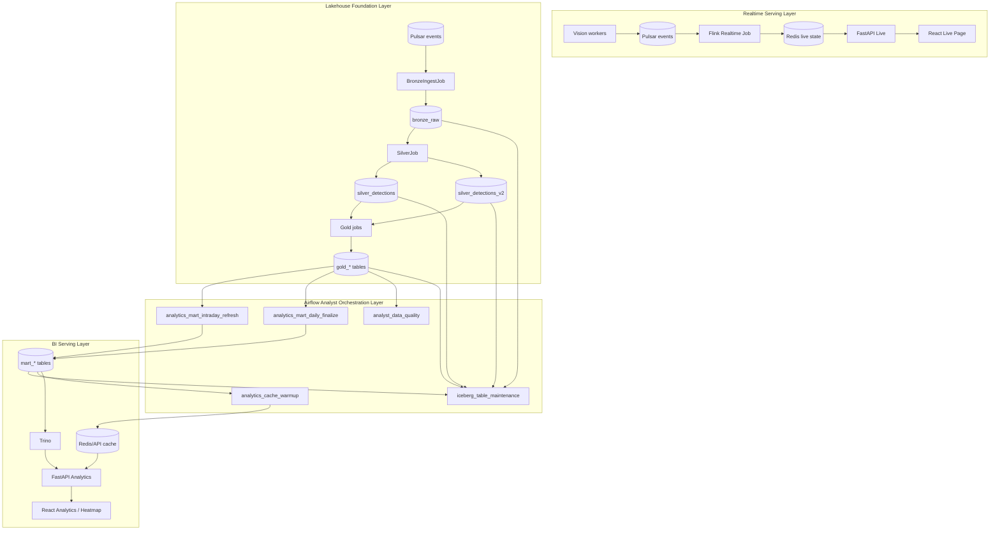

# Airflow Analyst Architecture

Tài liệu này chốt vai trò của Airflow trong project Retail Video Analytics. Kết luận chính:

> Airflow không thay Flink. Airflow bổ sung tầng batch-style analyst mart, Iceberg maintenance, data quality và cache warming để dashboard analyst không phải query trực tiếp bảng fact lớn.

## 1. Bối cảnh hiện tại

Project hiện có hai đường xử lý chính:

```text
Realtime path:
Vision -> Pulsar -> Flink DataStream -> Redis -> FastAPI -> React Live

Lakehouse path:
Vision -> Pulsar -> Flink Table API -> Iceberg Bronze/Silver/Gold -> Trino -> FastAPI Analytics
```

Realtime path phục vụ trạng thái hiện tại:

- current count;
- active tracks;
- live frame;
- live heatmap;
- live queue;
- recent alerts.

Lakehouse path phục vụ lịch sử:

- dashboard analytics;
- queue session history;
- alert history;
- historical heatmap;
- thesis evaluation;
- ad hoc SQL.

Điểm còn yếu là analyst dashboard có thể vẫn phải query hoặc aggregate từ bảng quá thấp tầng như `silver_detections_v2`. Bảng này có grain rất nhỏ:

```text
1 row = 1 person detection trong 1 frame
```

Với video analytics, số dòng tăng nhanh. Query dashboard trực tiếp trên Silver sẽ chậm, đặc biệt với heatmap và các biểu đồ theo khoảng thời gian dài.

> **Đính chính nút thắt thật (verified 2026-06-11):** ở scale hiện tại `silver_detections_v2` chỉ có **~96.000 rows** nhưng nằm trên **~2.519 file parquet** (~38 rows/file). Nút thắt **không phải row volume** mà là **small files + Trino single-node + S3 remote round-trips** — Flink commit mỗi 30s sinh hàng nghìn file tí hon. Hệ quả: riêng **compaction (`OPTIMIZE`)** có thể làm heatmap đủ nhanh ở scale này *trước khi* cần tới mart. Mart vẫn đúng về kiến trúc (tốt cho scale tương lai + thesis narrative), nhưng hãy **đo lại sau compaction** rồi mới chốt phạm vi mart heatmap. Xem Phase 0 trong `05_IMPLEMENTATION_ROADMAP.md`.

## 2. Vì sao cần Airflow

Airflow là orchestrator cho batch workflows. Theo tài liệu chính thức, Airflow phù hợp với workflow hữu hạn, chạy theo lịch, có start/end rõ ràng; nó không được thiết kế để chạy streaming workload liên tục. Vì vậy Airflow nên bổ sung cho Flink, không thay thế Flink.

Trong project này:

| Thành phần | Vai trò đúng |
|---|---|
| Flink Realtime | Xử lý stream low-latency và ghi Redis |
| Flink Lakehouse | Materialize Bronze/Silver/Gold near-real-time vào Iceberg |
| Airflow | Điều phối batch-style marts, quality checks, maintenance, cache warming |
| Trino | SQL engine đọc Iceberg snapshot |
| FastAPI | Semantic API và cache layer cho dashboard |
| React | UI live/analyst/system |

> **Ràng buộc RAM bắt buộc (host 15GB):** full stack + 3 camera đã chạm **11–12GB** và từng gây freeze phải tắt máy. Airflow (`webserver` + `scheduler` + Postgres metadata) tốn thêm **~1–2GB**. Vì vậy:
> - Đặt Airflow vào **compose profile riêng** (`--profile airflow`), **không** bật cùng lúc với live demo 3 camera.
> - Chỉ dùng `LocalExecutor` + Postgres nhẹ; **không** `CeleryExecutor`.
> - Nếu chỉ cần mart-refresh + maintenance cho scope thesis, có thể thay Airflow bằng **cron + script gọi Trino** (1 container nhẹ). Chọn Airflow khi muốn *trình diễn năng lực orchestration* trong luận văn — và khi đó phải quản RAM theo profile.

## 3. Kiến trúc mục tiêu



## 4. Ranh giới trách nhiệm

### Flink

Flink vẫn là engine chính cho stream và near-real-time lakehouse:

- consume Pulsar;
- parse/validate/deduplicate;
- ghi Redis realtime;
- ghi Bronze raw;
- flatten sang Silver;
- tạo Gold near-real-time như track summary, queue sessions, zone minute metrics, dashboard aggregates.

Flink phù hợp với các stateful operations theo event-time:

- active tracks;
- queue session;
- zone occupancy;
- line crossing;
- rolling metrics;
- checkpointed streaming writes.

### Airflow

Airflow không đọc từng event và không xử lý stream. Airflow làm các việc hữu hạn, có lịch:

- refresh mart tables theo window;
- finalize daily partition;
- chạy compaction/maintenance;
- chạy `ANALYZE`;
- chạy data quality checks;
- warm cache cho API;
- ghi audit status cho từng mart refresh.

### Trino

Trino là query engine. Trino không nên bị dùng như ETL engine nặng cho mỗi request UI. Trino nên:

- đọc mart tables nhỏ;
- trả kết quả bounded cho FastAPI;
- chạy SQL maintenance do Airflow gọi;
- phục vụ ad hoc query khi cần debug.

### FastAPI

FastAPI nên là semantic layer:

- định nghĩa endpoint theo dashboard;
- query mart table đúng;
- cache response;
- trả empty/stale status rõ ràng;
- không để UI tự biết quá nhiều chi tiết bảng Iceberg.

## 5. Layering chuẩn sau khi thêm Airflow

```text
Source
  Vision metadata events

Bronze
  Raw immutable event log

Silver
  Cleaned detection-level facts

Gold
  Business-level near-real-time aggregates

Mart
  Dashboard-specific, query-ready tables

API Cache
  Short-lived semantic cache for analyst endpoints

BI/UI
  React pages with minimal grouping logic
```

## 6. Query rule bắt buộc

| Use case | Nguồn dữ liệu đúng |
|---|---|
| Live current count | Redis |
| Live frame | runtime/live_frames hoặc media endpoint |
| Live alerts | Redis alert state |
| Analyst KPI cards | `mart_executive_daily`, `mart_traffic_hourly` |
| Traffic chart | `mart_traffic_hourly`, `mart_traffic_daily` |
| Queue dashboard | `mart_queue_hourly`, `mart_queue_daily` |
| Historical heatmap | `mart_heatmap_tile_5min`, `mart_heatmap_tile_hour` |
| Zone dashboard | `mart_zone_hourly`, `mart_zone_daily` |
| Alert history | `mart_alert_daily`, `gold_alert_events` for drill-down |
| Debug/replay | `silver_*`, `bronze_raw` |

Rule quan trọng:

```text
Dashboard mặc định không query Bronze.
Dashboard mặc định không query Silver.
Silver chỉ dùng cho drill-down/debug hoặc backfill mart.
```

## 7. Tại sao kiến trúc này giải quyết dashboard chậm

Trước:

```text
React -> FastAPI -> Trino -> silver_detections_v2 -> GROUP BY / aggregate
```

Hậu quả:

- scan nhiều detection rows;
- nhiều file nhỏ từ streaming writes;
- planning time cao;
- S3 remote read chậm;
- UI reload là chạy lại query nặng.

Sau:

```text
Airflow refresh mart_* theo lịch
React -> FastAPI cache -> Trino -> mart_* tables
```

Lợi ích:

- query ít rows hơn;
- grain khớp dashboard;
- có thể compact/analyze riêng;
- cache theo TTL;
- có audit để biết mart nào đã refresh thành công.

## 8. Bảng hiện tại và bảng cần bổ sung

### Hiện tại

| Layer | Bảng |
|---|---|
| Bronze | `lakehouse.rva.bronze_raw` |
| Silver | `lakehouse.rva.silver_detections` (v1), `lakehouse.rva.silver_detections_v2` |
| Gold | `gold_track_summary`, `gold_track_summary_v2`, `gold_queue_sessions`, `gold_zone_minute_metrics`, `gold_camera_hourly_metrics`, `gold_camera_daily_metrics`, `gold_camera_daily_dwell`, `gold_alert_events`, `gold_alerts` |

> **Đính chính tình trạng thật (verified `GoldDashboardAggregateJob.java`, 2026-06-11):**
> - 4 bảng `gold_camera_hourly_metrics` / `gold_camera_daily_metrics` / `gold_camera_daily_dwell` / `gold_alert_events` được tạo bằng `CREATE TABLE IF NOT EXISTS` + gộp `StatementSet` (1 job). Chúng **không phải bảng ảo** — trước đây "không tồn tại" chỉ vì job không được submit (bug submitter, đã fix ở commit `600be79`). **Cần verify** `SHOW TABLES` + `COUNT(*)` khi stack chạy lại.
> - **Dual silver lineage:** `GoldDashboardAggregateJob` (hourly/daily/dwell/alert_events) đọc từ **`silver_detections` v1** + `gold_track_summary` v1; còn `QueueAnalyticsJob` và Heatmap API đọc từ **`silver_detections_v2`**. Tầng analyst đang phụ thuộc **cả hai nhánh**. Rủi ro: deprecate v1 sẽ làm traffic/dwell dashboard chết âm thầm. → Nên thống nhất `GoldDashboardAggregateJob` đọc v2, hoặc ghi rõ v1 là dependency bắt buộc.
> - **Hai bảng alert khác semantics:** `gold_alerts` (từ `GoldAlertsJob`, đếm **clip incident**) ≠ `gold_alert_events` (từ `GoldDashboardAggregateJob`, đếm **mỗi frame vượt ngưỡng density_high**). Không dùng thay thế nhau khi xây mart alert.

### Cần bổ sung

| Layer | Bảng |
|---|---|
| Mart | `mart_executive_daily` |
| Mart | `mart_traffic_hourly`, `mart_traffic_daily` |
| Mart | `mart_heatmap_tile_5min`, `mart_heatmap_tile_hour` |
| Mart | `mart_zone_hourly`, `mart_zone_daily` |
| Mart | `mart_queue_hourly`, `mart_queue_daily` |
| Mart | `mart_dwell_daily`, `mart_zone_dwell_daily` |
| Mart | `mart_alert_hourly`, `mart_alert_daily` |
| Audit | `mart_refresh_audit`, `data_quality_results` |

## 9. Độ tươi dữ liệu kỳ vọng

| Tầng | Freshness |
|---|---|
| Redis live | 1-5 giây |
| Bronze/Silver Iceberg | phụ thuộc checkpoint, thường vài chục giây đến vài phút |
| Gold streaming | phụ thuộc checkpoint/window |
| Intraday mart | 5-15 phút |
| Daily mart | finalize sau ngày, ví dụ 01:00-02:00 |
| Historical heatmap mart | 5-30 phút tùy window |

Đây là trade-off hợp lý:

```text
Live dashboard ưu tiên freshness.
Analyst dashboard ưu tiên query nhanh, ổn định, có số liệu đã chuẩn bị.
```

## 10. Tài liệu tham khảo chính

- Apache Airflow documentation: https://airflow.apache.org/docs/apache-airflow/stable/index.html
- Apache Iceberg Flink writes: https://iceberg.apache.org/docs/latest/flink-writes/
- Apache Iceberg maintenance: https://iceberg.apache.org/docs/latest/maintenance/
- Trino Iceberg connector: https://trino.io/docs/current/connector/iceberg.html
