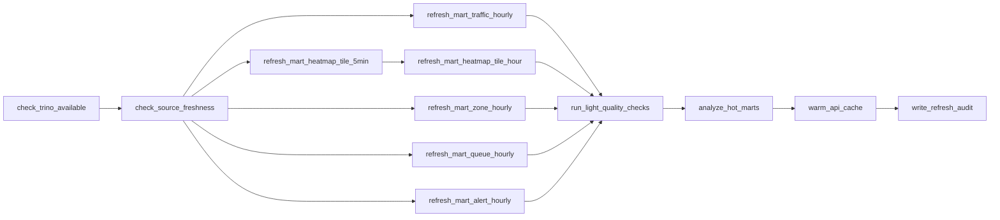
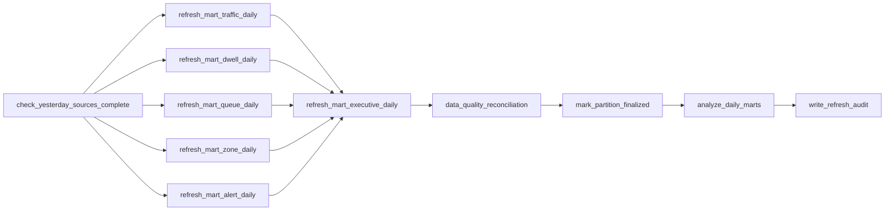

# Airflow DAGs Và Vận Hành Analyst Layer

Tài liệu này thiết kế các DAG Airflow cần thêm cho tầng analyst. Airflow chỉ điều phối workflow; compute chính nên chạy bằng Trino SQL, Spark/Flink batch hoặc dbt tùy phase.

## 1. Nguyên tắc DAG

### 1.1 DAG có start/end rõ ràng

Airflow phù hợp với workflow hữu hạn:

```text
check source -> refresh mart -> validate -> analyze -> warm cache -> audit
```

Không dùng Airflow để:

- consume Pulsar liên tục;
- chạy YOLO/Vision;
- xử lý từng detection event;
- thay Flink realtime.

### 1.2 Task không xử lý data lớn trong Python

Python task chỉ nên:

- submit SQL vào Trino;
- gọi API nội bộ;
- ghi audit nhỏ;
- kiểm tra row count;
- parse kết quả metadata.

Không nên:

- load `silver_detections_v2` vào pandas;
- đọc file S3 thủ công;
- aggregate detection rows trong Python.

### 1.3 Mọi mart refresh phải có audit

Mỗi task mart cần ghi:

- source table;
- source time range;
- output row count;
- status;
- started_at/finished_at;
- error_message nếu fail.

## 2. DAG tổng quan

| DAG | Schedule | Mục tiêu |
|---|---|---|
| `analytics_mart_intraday_refresh` | mỗi 5-15 phút | Refresh mart cho ngày hiện tại / last N hours |
| `analytics_mart_daily_finalize` | 01:00-02:00 hằng ngày | Finalize mart ngày hôm qua |
| `iceberg_table_maintenance` | mỗi 1-6 giờ và daily | Compact, expire snapshot, remove orphan, analyze |
| `analyst_data_quality` | sau mart refresh hoặc hourly | Kiểm tra Bronze/Silver/Gold/Mart |
| `analytics_cache_warmup` | sau mart refresh | Warm Redis/API cache cho dashboard |
| `analyst_backfill` | manual | Backfill mart theo date range |

## 3. DAG 1: `analytics_mart_intraday_refresh`

Mục tiêu:

```text
Làm cho analyst dashboard trong ngày có dữ liệu mới mà không query Silver/Gold thô.
```

Schedule gợi ý:

```text
*/15 * * * *
```

Với demo có thể dùng:

```text
*/5 * * * *
```

Window xử lý:

```text
current_date
last 2 hours
```

### Task graph



### Source freshness checks

Các check tối thiểu:

```sql
SELECT max(capture_ts) FROM lakehouse.rva.silver_detections_v2;
SELECT max(window_end) FROM lakehouse.rva.gold_zone_minute_metrics;
SELECT max(exit_ts) FROM lakehouse.rva.gold_queue_sessions;
```

Nếu source quá stale:

- vẫn có thể refresh mart bằng dữ liệu hiện có;
- nhưng ghi `status = stale_source` vào audit;
- API có thể hiển thị warning thay vì lỗi trắng.

### Refresh strategy

**Mặc định: refresh last 1–2 giờ, KHÔNG cả ngày.** `DELETE current-day + INSERT` mỗi 15 phút sinh delete-files + data-files mỗi lần → mart tự tích tụ small files (96 lần/ngày). Chỉ xóa/ghi lại cửa sổ gần nhất:

```sql
DELETE FROM lakehouse.rva_mart.mart_heatmap_tile_5min
WHERE bucket_start >= date_trunc('hour', CURRENT_TIMESTAMP) - INTERVAL '2' HOUR;

INSERT INTO lakehouse.rva_mart.mart_heatmap_tile_5min
SELECT
  store_id,
  camera_id,
  date_trunc('minute', capture_ts)
    - (minute(capture_ts) % 5) * INTERVAL '1' MINUTE  AS bucket_start,
  CAST(capture_ts AS DATE)                            AS metric_date,
  32 AS grid_width, 24 AS grid_height,
  -- clamp giống heatmap_presence_sql production để số khớp dashboard cũ
  LEAST(31, GREATEST(0, CAST(FLOOR(anchor_x_norm * 32) AS INTEGER))) AS tile_x,
  LEAST(23, GREATEST(0, CAST(FLOOR(anchor_y_norm * 24) AS INTEGER))) AS tile_y,
  COUNT(*) AS detection_count,
  approx_set(global_track_id) AS unique_tracks_hll,   -- non-additive: dùng HLL, KHÔNG SUM
  AVG(conf) AS avg_conf
FROM lakehouse.rva.silver_detections_v2
WHERE capture_ts >= date_trunc('hour', CURRENT_TIMESTAMP) - INTERVAL '2' HOUR
  AND class_id = 0
  AND is_predicted = false
  AND anchor_x_norm IS NOT NULL
  AND anchor_y_norm IS NOT NULL
GROUP BY 1,2,3,4,5,6,7,8;
```

> **Parity bắt buộc với query production:** filter và phép chia lưới phải **giống hệt** `heatmap_presence_sql` hiện tại (`class_id=0`, `is_predicted=false`, `anchor_* IS NOT NULL`, clamp `LEAST/GREATEST`), nếu không heatmap-từ-mart sẽ ra **số khác** dashboard cũ → migration không trong suốt. Đừng thêm `global_track_id IS NOT NULL` hay `BETWEEN 0 AND 1` trừ khi sửa luôn query production cho khớp.

Daily finalize (chạy 1 lần/ngày cho hôm qua) mới dùng `DELETE WHERE metric_date = <yesterday>` toàn ngày — vì chỉ chạy 1 lần nên không gây churn.

## 4. DAG 2: `analytics_mart_daily_finalize`

Mục tiêu:

```text
Chốt số liệu ngày hôm qua theo tư duy data warehouse.
```

Schedule:

```text
0 2 * * *
```

Processing date:

```text
{{ ds - 1 day }}
```

### Task graph



### Daily finalize rule

Daily marts sau khi finalize nên ổn định. Nếu cần sửa data:

- chạy backfill có audit;
- ghi lại `refreshed_at`;
- dashboard vẫn query partition mới nhất.

## 5. DAG 3: `iceberg_table_maintenance`

Mục tiêu:

```text
Giữ Iceberg tables nhanh và sạch cho Trino.
```

Vấn đề cần xử lý:

- nhiều small files do streaming commits;
- nhiều snapshots;
- nhiều manifests;
- delete files từ upsert;
- statistics thiếu cho query planner.

### Task graph



```mermaid
flowchart LR
  A[inspect_table_files]
  B[optimize_recent_silver]
  C[optimize_recent_gold]
  D[optimize_recent_marts]
  E[optimize_manifests_if_needed]
  F[expire_snapshots_safe]
  G[remove_orphan_files_safe]
  H[analyze_mart_tables]
  I[write_maintenance_audit]

  A --> B --> C --> D --> E --> F --> G --> H --> I
```

### Tables cần maintenance

Ưu tiên:

```text
lakehouse.rva.silver_detections_v2
lakehouse.rva.gold_queue_sessions
lakehouse.rva.gold_zone_minute_metrics
lakehouse.rva.gold_camera_hourly_metrics
lakehouse.rva_mart.mart_heatmap_tile_5min
lakehouse.rva_mart.mart_heatmap_tile_hour
lakehouse.rva_mart.mart_traffic_hourly
lakehouse.rva_mart.mart_queue_hourly
lakehouse.rva_mart.mart_zone_hourly
```

### Optimize examples

```sql
ALTER TABLE lakehouse.rva.silver_detections_v2
EXECUTE optimize(file_size_threshold => '128MB')
WHERE CAST(capture_ts AS DATE) >= CURRENT_DATE - INTERVAL '2' DAY;
```

```sql
ALTER TABLE lakehouse.rva_mart.mart_heatmap_tile_5min
EXECUTE optimize(file_size_threshold => '128MB')
WHERE metric_date >= CURRENT_DATE - INTERVAL '2' DAY;
```

### Snapshot cleanup

Không cleanup quá aggressive vì Flink streaming jobs cần checkpoint/snapshot continuity.

Dev/demo recommendation:

```text
expire snapshots retention: >= 7 days
remove orphan files retention: >= 7 days
retain_last: >= 20 snapshots for hot tables
```

Ví dụ:

```sql
ALTER TABLE lakehouse.rva_mart.mart_heatmap_tile_5min
EXECUTE expire_snapshots(retention_threshold => '7d', retain_last => 20);
```

```sql
ALTER TABLE lakehouse.rva_mart.mart_heatmap_tile_5min
EXECUTE remove_orphan_files(retention_threshold => '7d');
```

### ANALYZE examples

Chỉ analyze cột có ích:

```sql
ANALYZE lakehouse.rva_mart.mart_heatmap_tile_hour
WITH (columns = ARRAY['store_id', 'camera_id', 'metric_date', 'tile_x', 'tile_y']);
```

```sql
ANALYZE lakehouse.rva_mart.mart_queue_hourly
WITH (columns = ARRAY['store_id', 'camera_id', 'queue_zone_id', 'metric_date']);
```

## 6. DAG 4: `analyst_data_quality`

Mục tiêu:

```text
Phát hiện source/mart bị thiếu, stale hoặc sai logic.
```

### Checks tối thiểu

| Check | Rule |
|---|---|
| Bronze rows | `count(*) > 0` |
| Silver freshness | `max(capture_ts)` không quá cũ |
| Silver valid anchors | `anchor_x_norm/y_norm` trong `[0,1]` |
| Gold queue wait | `wait_time_sec >= 0` |
| Zone metrics | `avg_occupancy >= 0`, `max_occupancy >= avg_occupancy` |
| Heatmap tile range | `tile_x/y` trong grid |
| Mart row count | output rows > 0 cho partition có source |
| Duplicate mart key | không duplicate theo grain |

### Severity

| Severity | Ý nghĩa |
|---|---|
| `info` | Có thể dùng để hiển thị context |
| `warning` | Dashboard vẫn chạy nhưng có stale/empty state |
| `error` | Mart không nên được publish/cache |
| `critical` | Pipeline foundation sai, cần dừng refresh phụ thuộc |

## 7. DAG 5: `analytics_cache_warmup`

Mục tiêu:

```text
Sau khi mart refresh xong, warm sẵn các API response phổ biến.
```

Cache key gợi ý:

```text
analytics:dashboard:store_001:today
analytics:traffic:store_001:cam_01:1d
analytics:heatmap:cam_01:1d
analytics:heatmap:cam_01:7d
analytics:queue:store_001:7d
analytics:alerts:store_001:7d
```

TTL:

| Endpoint | TTL |
|---|---|
| dashboard today | 60s |
| traffic hourly | 300s |
| heatmap 1d | 300s |
| heatmap 7d/14d/30d | 900s-1800s |
| queue analytics | 300s |
| alert history | 300s |

## 8. DAG 6: `analyst_backfill`

Manual DAG cho backfill:

Inputs:

```text
start_date
end_date
mart_names
camera_ids optional
force_refresh boolean
```

Use cases:

- mới thêm mart;
- đổi business logic;
- fix bug schema;
- demo cần rebuild dữ liệu.

Backfill nên chạy theo date partition, không chạy toàn bộ một lần.

## 9. Airflow variables/connections

Connections:

| Connection | Dùng cho |
|---|---|
| `trino_default` | chạy SQL trên Trino |
| `redis_default` | warm cache, đọc cache status |
| `aws_default` | optional S3 checks |
| `fastapi_internal` | optional gọi endpoint warm/cache |

Variables:

| Variable | Ví dụ |
|---|---|
| `rva_store_id` | `store_001` |
| `rva_mart_schema` | `lakehouse.rva_mart` |
| `rva_source_schema` | `lakehouse.rva` |
| `rva_heatmap_grid_width` | `32` |
| `rva_heatmap_grid_height` | `24` |
| `rva_queue_sla_sec` | `120` |
| `rva_snapshot_retention_days` | `7` |

## 10. Retry và alerting

Retry policy:

```text
check tasks: 1-2 retries
refresh mart tasks: 2 retries
maintenance tasks: 1 retry
cache warmup: best-effort
```

Alert:

- task fail;
- mart output rows bất thường;
- source stale;
- Trino unavailable;
- Iceberg maintenance fail;
- data quality critical.

## 11. Gợi ý triển khai ban đầu

Phase đầu không cần cài provider phức tạp. Có thể dùng:

- Python task gọi Trino REST API;
- hoặc `TrinoOperator` nếu thêm Airflow Trino provider;
- SQL files trong `services/airflow/dags/sql/`;
- audit insert sau mỗi task.

Cấu trúc thư mục gợi ý:

```text
services/airflow/
├── dags/
│   ├── analytics_mart_intraday_refresh.py
│   ├── analytics_mart_daily_finalize.py
│   ├── iceberg_table_maintenance.py
│   ├── analyst_data_quality.py
│   └── analyst_backfill.py
├── sql/
│   ├── marts/
│   ├── maintenance/
│   └── quality/
└── README.md
```
