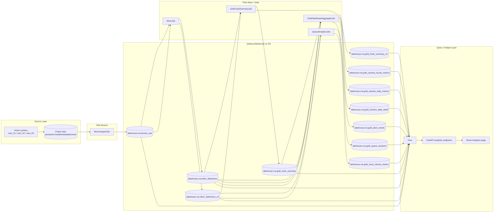
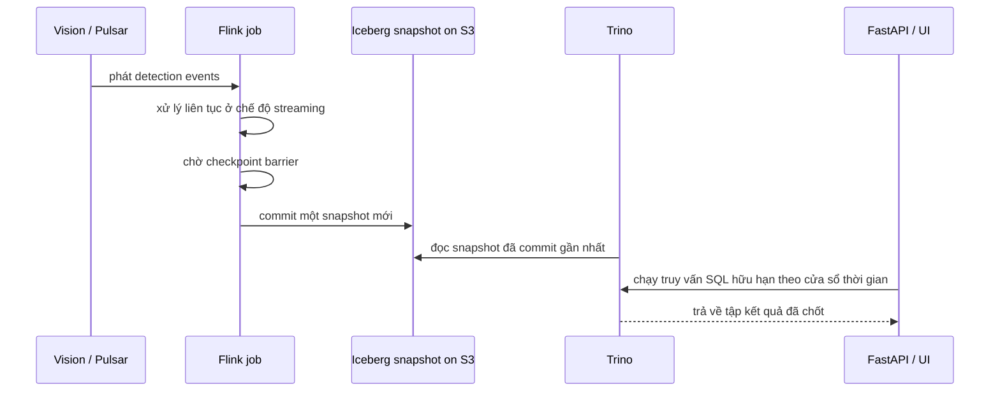

# Lineage Lakehouse Cho Tầng Analyst

Tài liệu này mô tả cách project hiện tại dùng Flink, Iceberg trên S3 và Trino để phục vụ dữ liệu cho tầng analyst.

Ý chính là:

- Flink chạy liên tục ở chế độ streaming.
- Iceberg lưu dữ liệu dưới dạng snapshot đã commit trên S3.
- Trino đọc các snapshot đó như kết quả SQL hữu hạn.
- UI và API analyst chỉ query các bảng đã xử lý sẵn, không đọc thẳng live stream.

## Bộ tài liệu trong thư mục này

| Tài liệu | Mục đích |
|---|---|
| [README.md](README.md) | Lineage hiện tại từ Vision/Pulsar đến Flink, Iceberg, Trino và API analyst |
| [01_AIRFLOW_ANALYST_ARCHITECTURE.md](01_AIRFLOW_ANALYST_ARCHITECTURE.md) | Quyết định kiến trúc: thêm Airflow nhưng không thay Flink |
| [02_BI_MART_TABLE_DESIGN.md](02_BI_MART_TABLE_DESIGN.md) | Thiết kế các bảng mart phục vụ dashboard analyst |
| [03_AIRFLOW_DAGS_AND_OPERATIONS.md](03_AIRFLOW_DAGS_AND_OPERATIONS.md) | Thiết kế DAGs Airflow, refresh windows, data quality và maintenance |
| [04_QUERY_ROUTING_CACHE_AND_PERFORMANCE.md](04_QUERY_ROUTING_CACHE_AND_PERFORMANCE.md) | Quy tắc query routing, cache API, tối ưu Trino/Iceberg |
| [05_IMPLEMENTATION_ROADMAP.md](05_IMPLEMENTATION_ROADMAP.md) | Roadmap triển khai Airflow analyst layer theo phase |

Quyết định kiến trúc mới là:

```text
Flink tạo Bronze/Silver/Gold near-real-time trong Iceberg.
Airflow điều phối batch-style BI marts, maintenance, data quality và cache warming.
Trino/FastAPI/React analyst chỉ đọc mart tables hoặc Gold tables đã được chuẩn bị sẵn.
```

## 1) Lineage end-to-end



## 2) Vì sao nó có cảm giác như batch



Mô hình thực tế của project là:

- Job là streaming job, nhưng dữ liệu chỉ xuất hiện trong Iceberg sau khi checkpoint commit xong.
- Trino không bám theo stream. Trino đọc snapshot của bảng đã commit.
- Vì vậy trang analyst nhìn giống đang chạy trên batch table, dù Flink luôn chạy.

## 3) Danh sách bảng theo tầng

### Bronze

| Bảng | Job ghi | Mục đích |
|---|---|---|
| `lakehouse.rva.bronze_raw` | `BronzeIngestJob` | Lưu raw frame event, phục vụ replay và audit |

### Silver

| Bảng | Job ghi | Mục đích |
|---|---|---|
| `lakehouse.rva.silver_detections` | `SilverJob` | Bảng detection phẳng tương thích legacy |
| `lakehouse.rva.silver_detections_v2` | `SilverJob` | Detection đã enrich với global track, zone, queue, anchor facts |

### Gold track/session

| Bảng | Job ghi | Mục đích |
|---|---|---|
| `lakehouse.rva.gold_track_summary` | `GoldTrackSummaryJob` | Track summary theo kiểu legacy |
| `lakehouse.rva.gold_track_summary_v2` | `GoldTrackSummaryJob` | Bản dùng global track cho pipeline mới |
| `lakehouse.rva.gold_queue_sessions` | `QueueAnalyticsJob` | Lưu lịch sử session queue và wait time |
| `lakehouse.rva.gold_zone_minute_metrics` | `QueueAnalyticsJob` | Metric occupancy theo zone mỗi phút |

### Gold analyst aggregates

| Bảng | Job ghi | Mục đích |
|---|---|---|
| `lakehouse.rva.gold_camera_hourly_metrics` | `GoldDashboardAggregateJob` | KPI traffic theo giờ cho dashboard |
| `lakehouse.rva.gold_camera_daily_metrics` | `GoldDashboardAggregateJob` | KPI traffic và chất lượng theo ngày |
| `lakehouse.rva.gold_camera_daily_dwell` | `GoldDashboardAggregateJob` | Metric dwell theo ngày từ track summary |
| `lakehouse.rva.gold_alert_events` | `GoldDashboardAggregateJob` | Lịch sử alert cho giao diện analyst |

## 4) Đường query của analyst

Tầng analyst không đọc trực tiếp stream raw. Nó query các bảng Iceberg ổn định thông qua Trino:

- KPI cards và biểu đồ trend đọc từ `gold_camera_hourly_metrics`, `gold_camera_daily_metrics`, `gold_camera_daily_dwell`.
- Analytic queue đọc từ `gold_queue_sessions` và `gold_zone_minute_metrics`.
- Lịch sử alert đọc từ `gold_alert_events`.
- Heatmap lịch sử đọc từ `silver_detections_v2`.

Vì vậy UI analyst có thể trống ngay sau restart dù pipeline vẫn khỏe: các bảng chỉ hữu ích khi Flink đã xử lý đủ rows và commit snapshot.

## 5) Lưu trữ vật lý và metadata

| Thành phần | Vai trò |
|---|---|
| S3 | Lưu file dữ liệu vật lý và metadata snapshot của Iceberg |
| Iceberg REST catalog | Quản lý metadata bảng và con trỏ đến warehouse |
| Flink checkpointing | Ranh giới commit cho các bảng Iceberg |
| Trino | Bộ đọc SQL trên các snapshot Iceberg đã commit |

Cluster Flink dùng checkpoint interval mặc định `30s` với timeout dài, còn `BronzeIngestJob` tự override checkpoint của nó thành `60s`. Ở phía đọc, các Flink jobs dựa trên Iceberg dùng `TABLE_SCAN_THEN_INCREMENTAL` để job restart có thể quét lại snapshot cũ rồi mới tiếp tục đọc incremental.

## 6) “Batch” ở đây có nghĩa gì

Trong project này, batch không phải là nightly ETL.

Nó có nghĩa là:

1. Event đến liên tục.
2. Flink xử lý liên tục.
3. Iceberg expose kết quả dưới dạng snapshot đã commit.
4. Trino đọc một snapshot hữu hạn theo cửa sổ truy vấn như `days=7`.
5. Trang analyst render kết quả truy vấn như một biểu đồ hoặc bảng tĩnh.

Nghĩa là hệ thống là streaming ở tầng ingest, nhưng batch-like ở tầng query.

## 7) Thứ tự debug thực tế

Nếu muốn debug lineage từ source đến UI analyst, đi theo thứ tự này:

1. Kiểm tra event từ Vision/Pulsar.
2. Kiểm tra `bronze_raw` trong Trino.
3. Kiểm tra `silver_detections` và `silver_detections_v2`.
4. Kiểm tra bảng Gold aggregate tương ứng.
5. Kiểm tra query FastAPI trong `services/api/src/rva_api/api/v1/analytics_queries.py`.
6. Kiểm tra page React cuối cùng.

Hệ thống hiện tại có nền lakehouse đúng, nhưng để tối ưu kiểu BI/data warehouse cần thêm Analyst Mart Layer. Dashboard nên ưu tiên đọc `mart_*` hoặc Gold table, và chỉ dùng Silver cho drill-down/debug, ví dụ khi cần kiểm tra lại detection-level facts.
