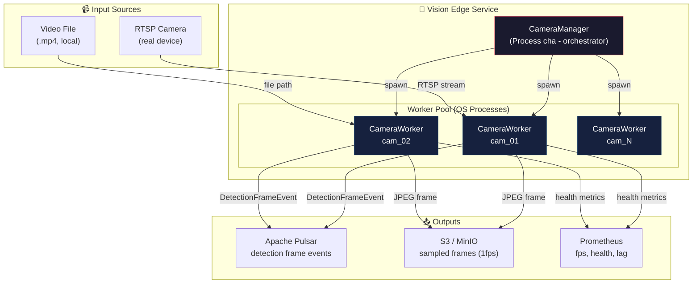
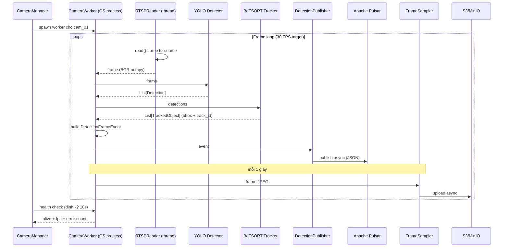

# 00 — Vision Service: Tổng quan

## Kiến trúc tổng thể Vision → Pulsar → S3

## Luồng dữ liệu tổng quát (1 camera)

## Các thành phần chính

| Thành phần | Kiểu | Trách nhiệm |
|-----------|------|-------------|
| **CameraManager** | Process chính | Load config, spawn/restart worker, health check, graceful shutdown |
| **CameraWorker** | OS Process (1/camera) | Pipeline: read → detect → track → publish. Cô lập crash |
| **RTSPReader** | Thread trong worker | Đọc frame từ RTSP/video file, buffer queue, reconnect |
| **YOLO Detector** | Object | Inference person detection, confidence filter |
| **BoTSORT Tracker** | Object | Gán track_id, tracking lifecycle |
| **DetectionPublisher** | Object | Publish event JSON lên Pulsar (async, retry) |
| **FrameSampler** | Object | Lưu frame mẫu 1fps vào S3/MinIO (async upload) |
