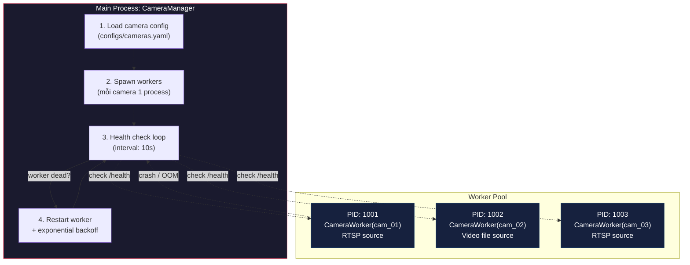
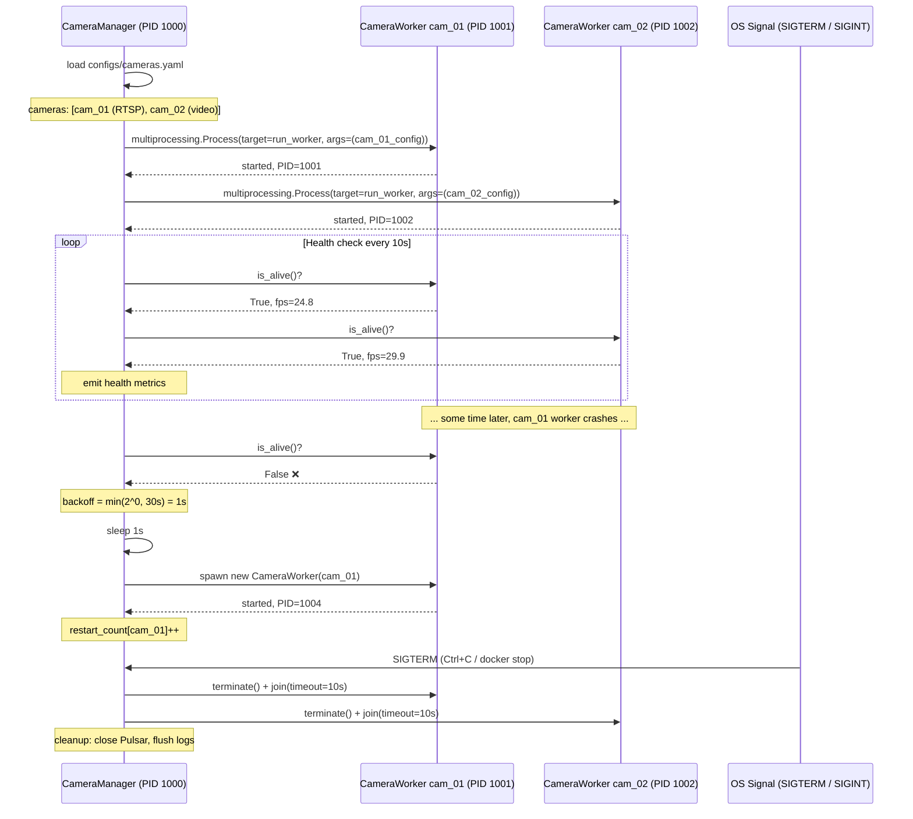
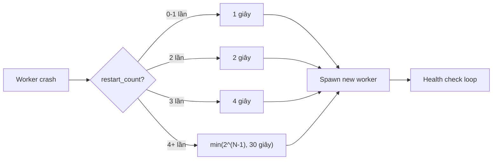

# 01 — CameraManager: Multi-camera Orchestrator

## Process model



## Lifecycle sequence



## Restart backoff policy



## Camera config contract

```yaml
# configs/cameras.yaml
cameras:
  - camera_id: cam_01
    store_id: store_001
    name: Entrance
    source_type: rtsp             # "rtsp" | "video_file"
    source_uri: rtsp://10.0.0.10:554/stream1
    enabled: true
    fps_target: 25
    resolution_width: 1920
    resolution_height: 1080

  - camera_id: cam_02
    store_id: store_001
    name: Aisle 3
    source_type: video_file       # "video_file" cho demo
    source_uri: data/videos/sample.mp4
    enabled: true
    fps_target: 30

settings:
  health_check_interval_sec: 10
  frame_queue_size: 2
  reconnect_delay_initial_sec: 1
  reconnect_delay_max_sec: 30
  worker_graceful_shutdown_sec: 10
```
