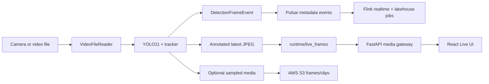

# Vision Overview

```mermaid
flowchart LR
    Camera[Camera or video file] --> Reader[VideoFileReader]
    Reader --> Tracker[YOLO11 + tracker]
    Tracker --> Event[DetectionFrameEvent]
    Tracker --> LiveFrame[Annotated latest JPEG]
    Tracker --> Sampled[Optional sampled media]

    Event --> Pulsar[Pulsar metadata events]
    LiveFrame --> Disk[runtime/live_frames]
    Sampled --> S3[AWS S3 frames/clips]

    Pulsar --> Flink[Flink realtime + lakehouse jobs]
    Disk --> API[FastAPI media gateway]
    API --> UI[React Live UI]
```

Vision owns frame reading, model inference, tracking, event creation, and annotated live-frame publishing. Video bytes do not go through Redis or Flink.
