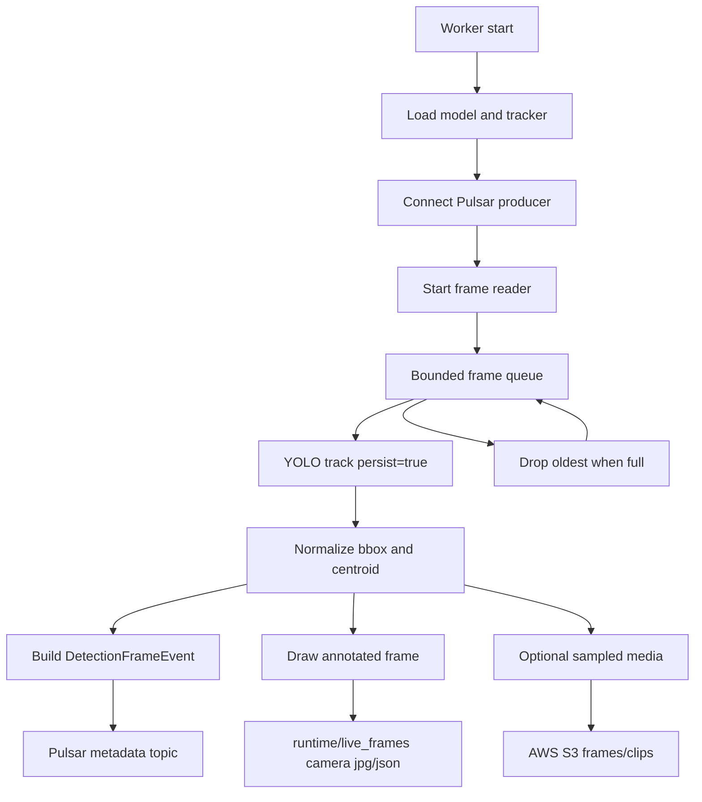

# Camera Worker Pipeline

```mermaid
flowchart TD
    Start[Worker start] --> Load[Load model and tracker]
    Load --> Connect[Connect Pulsar producer]
    Connect --> Reader[Start frame reader]
    Reader --> Queue[Bounded frame queue]
    Queue --> Track[YOLO track persist=true]
    Track --> Normalize[Normalize bbox and centroid]
    Normalize --> Event[Build DetectionFrameEvent]
    Normalize --> Draw[Draw annotated frame]
    Normalize --> Sample[Optional sampled media]

    Event --> Pulsar[Pulsar metadata topic]
    Draw --> LiveFile[runtime/live_frames camera jpg/json]
    Sample --> S3[AWS S3 frames/clips]

    Queue --> Drop[Drop oldest when full]
    Drop --> Queue
```

The queue is intentionally small. A realtime dashboard should prefer the newest available frame over delayed backlog.
