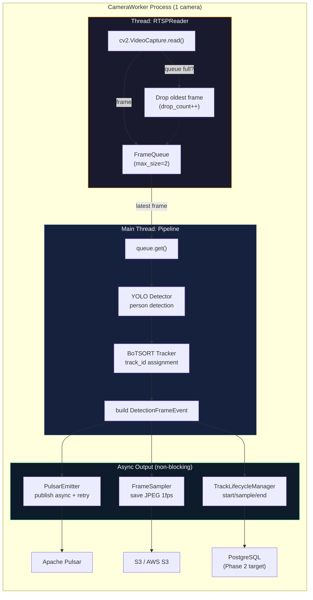
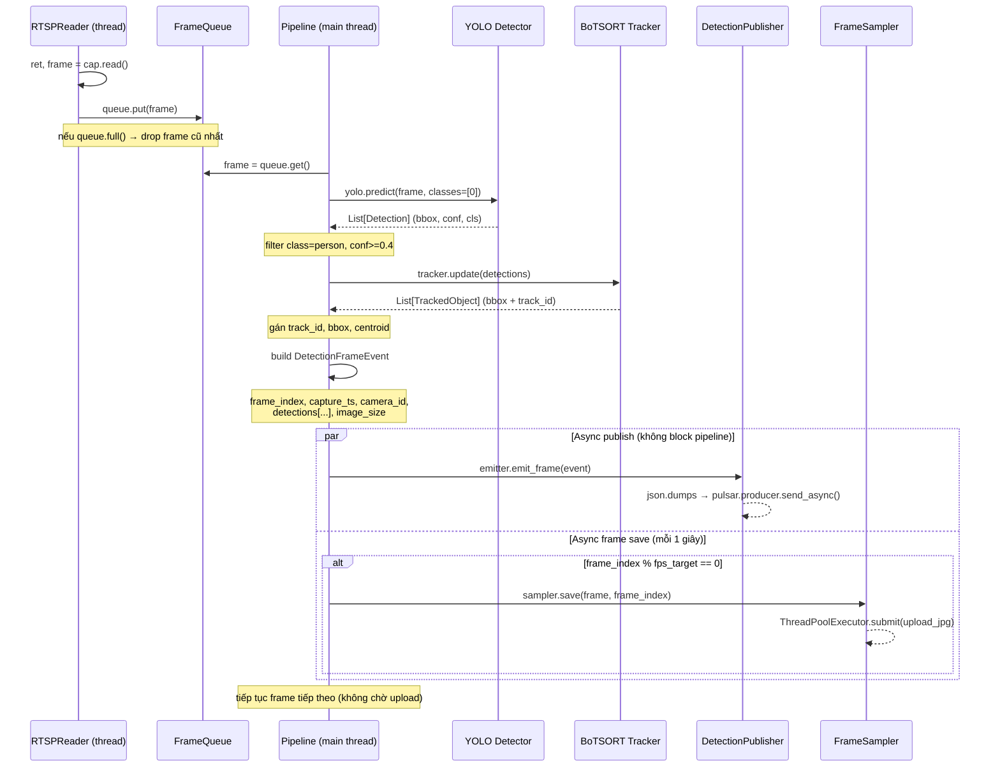
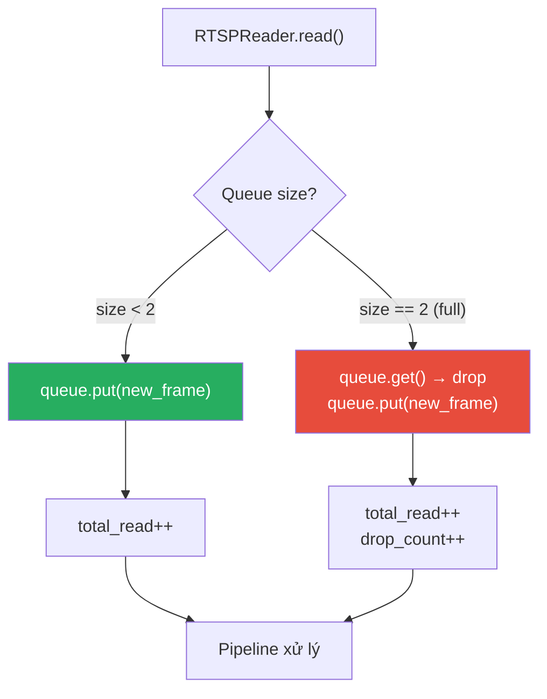

# 02 — CameraWorker: Internal Pipeline (1 camera)

## Pipeline tổng thể trong 1 worker

## Sequence: 1 frame qua pipeline

## Frame queue & dropping strategy

> **Nguyên tắc:** frame mới quan trọng hơn xử lý đủ mọi frame. Khi inference chậm hơn FPS camera, drop frame cũ để giữ realtime.
> 
> **FrameQueue phải dùng `queue.Queue(maxsize=2)`** (Python thread-safe). RTSPReader thread ghi, Pipeline main thread đọc.

## DetectionFrameEvent schema hiện tại → target

| Field | Hiện tại (Phase 1) | Target (Phase 2) |
|-------|-------------------|-----------------|
| `schema_version` | `"1.0"` (string) | `"1.0"` → `"2.0"` khi thêm field |
| `pipeline_run_id` | `uuid4().hex` | giữ nguyên |
| `source` | `{store_id, camera_id, stream_id}` | → **flatten**: `store_id`, `camera_id` top-level |
| `event_id` | **thiếu** | → thêm: `f"{camera_id}-{frame_index:09d}-{capture_ts}"` |
| `frame_index` | `int` (tăng dần) | giữ nguyên |
| `capture_ts` | ISO-8601 | giữ nguyên, thêm timezone `Z` |
| `image_size` | `{width, height}` | giữ nguyên |
| `detections[]` | `[{det_id, class, bbox, centroid, track_id}]` | → thêm `confidence`, `centroid_norm` |
| `runtime` | `{model_name, tracker_type}` | giữ nguyên, thêm `model_version` |
| `frame_ref` | **thiếu** | → thêm: `{saved: bool, uri: "s3://..."}` |
