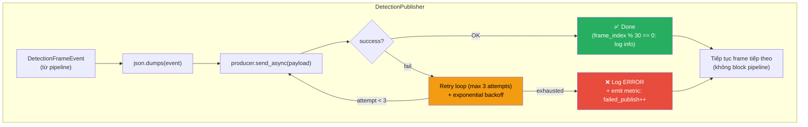
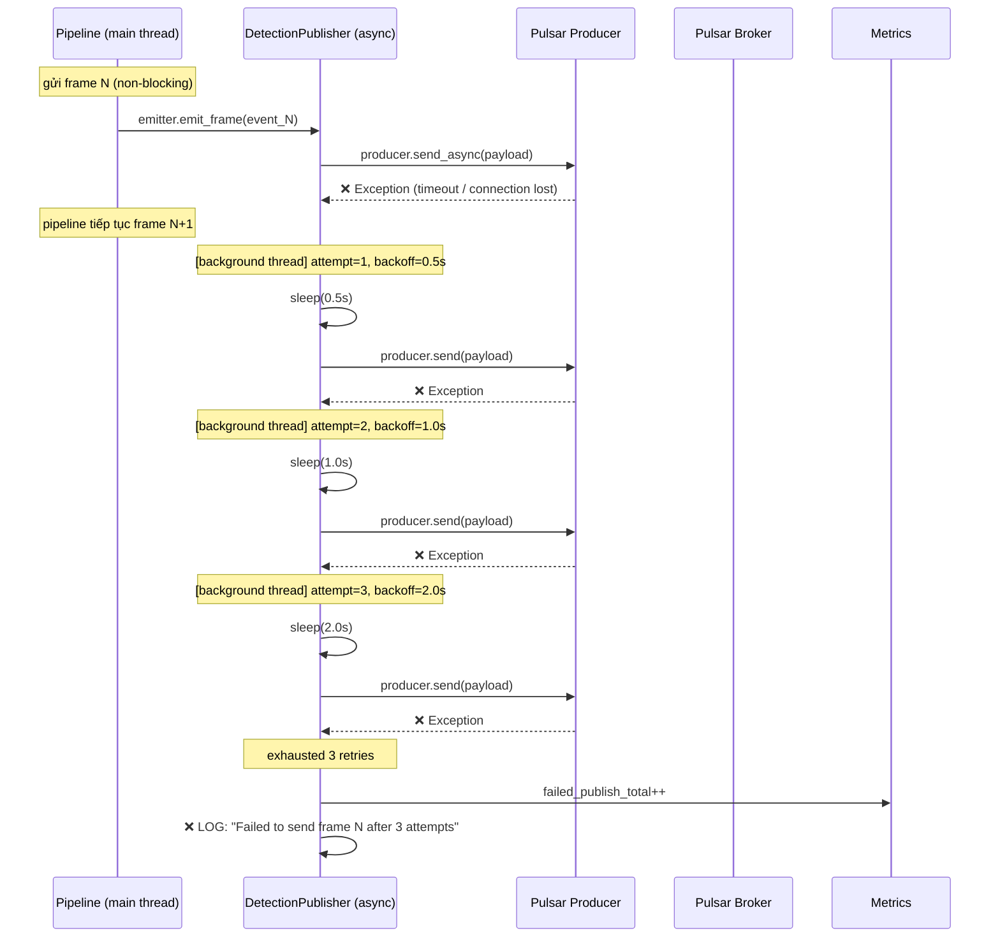
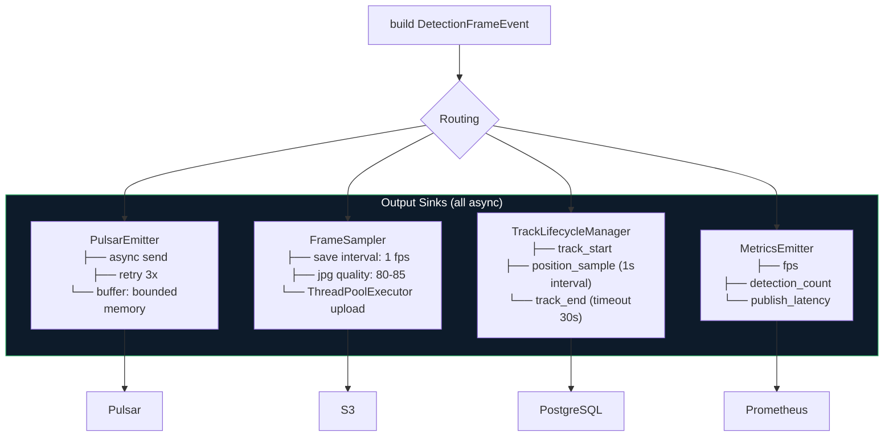
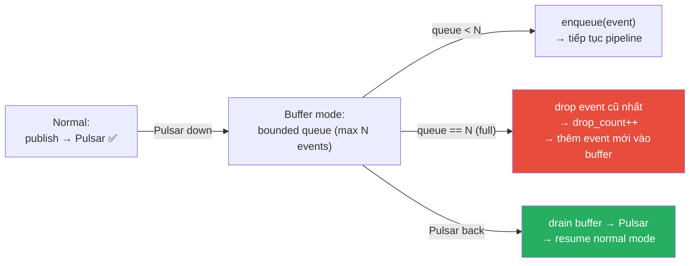

# 04 — DetectionPublisher: Publish lên Pulsar

## Publish flow với retry

## Retry backoff strategy

> **Retry chạy trong background thread.** Pipeline chính không bị block — tiếp tục xử lý frame tiếp theo trong khi retry xảy ra.

## Các sink output — non-blocking pattern

> **Nguyên tắc:** Không sink nào được block inference loop. Nếu 1 sink chậm/lỗi, các sink khác vẫn hoạt động. Pipeline chính luôn tiếp tục xử lý frame tiếp theo.

## Buffer bounded memory khi Pulsar unavailable

| Setting | Giá trị | Ghi chú |
|--------|--------|--------|
| `max_buffer_events` | 100 | Giới hạn memory |
| `drain_batch_size` | 10 | Gửi batch khi Pulsar trở lại |
| `drop_policy` | drop_oldest | Real-time: giữ frame mới nhất, drop frame cũ |
