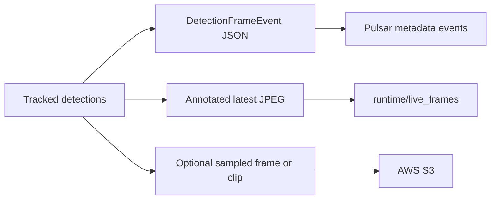

# Detection Publisher

```mermaid
flowchart LR
    Detections[Tracked detections] --> Contract[DetectionFrameEvent JSON]
    Contract --> Pulsar[Pulsar metadata events]
    Detections --> Live[Annotated latest JPEG]
    Live --> Disk[runtime/live_frames]
    Detections --> Media[Optional sampled frame or clip]
    Media --> S3[AWS S3]
```

The metadata event is the analytical source. Live JPEG and sampled media are media-plane artifacts used by the dashboard and investigation workflows.
