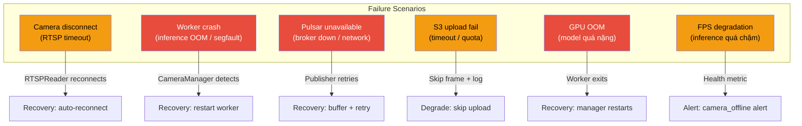
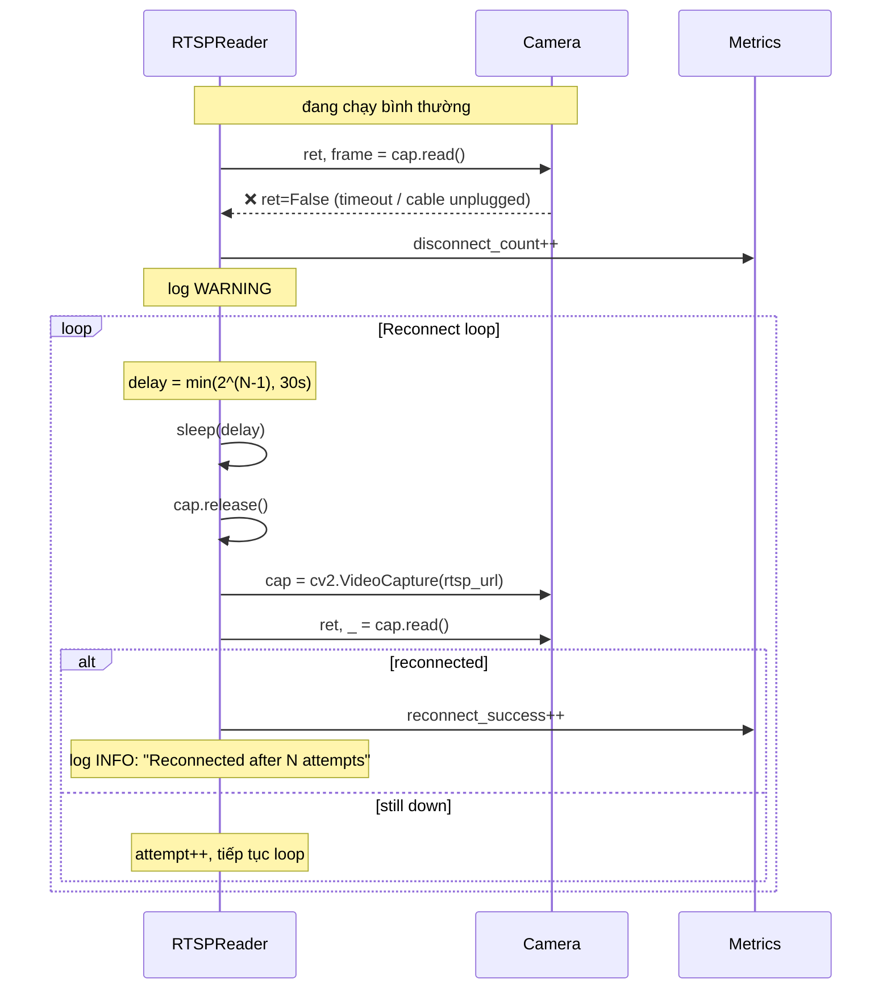
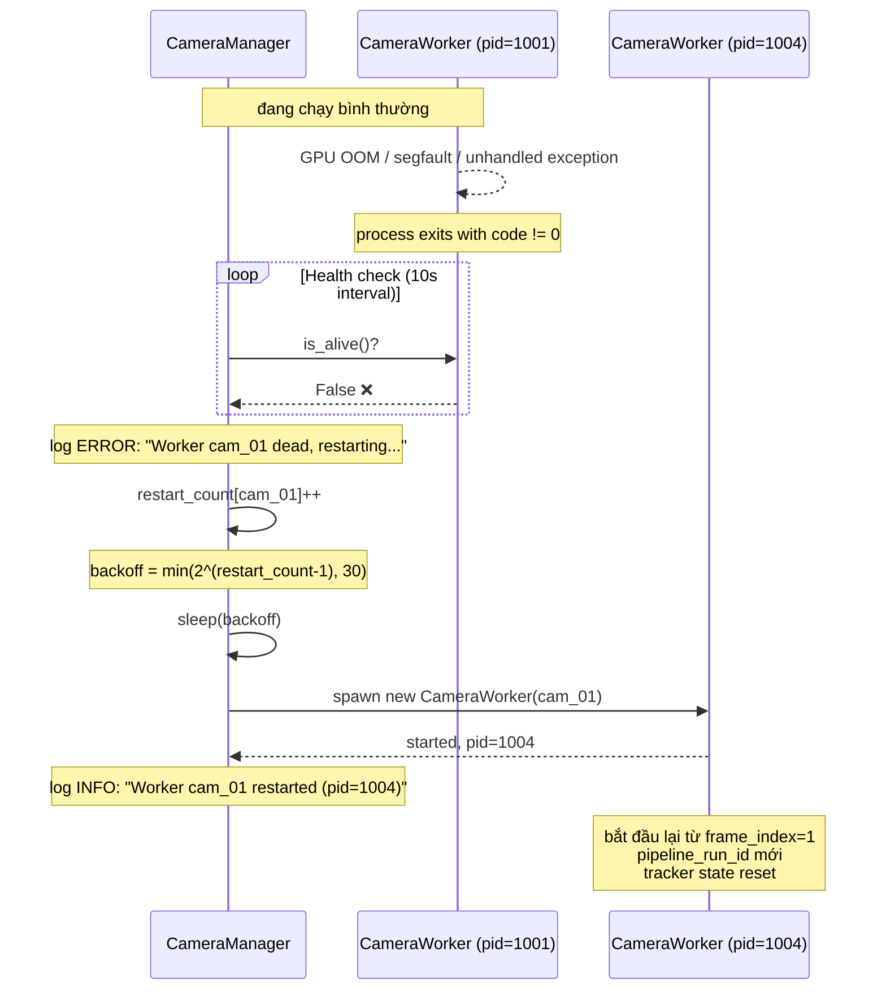
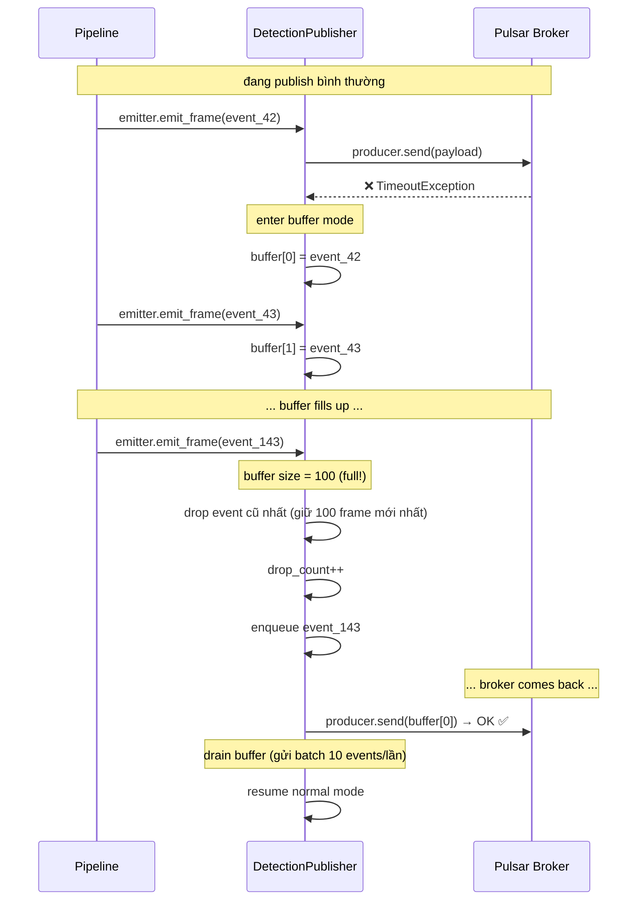
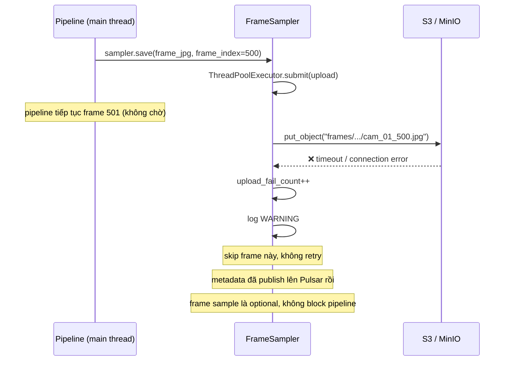

# 05 — Failure Handling & Recovery

## Failure scenarios overview

## Scenario 1: Camera disconnect → reconnect

## Scenario 2: Worker crash → restart

## Scenario 3: Pulsar unavailable → buffer + degrade

## Scenario 4: S3 upload fail → skip

## Summary: Failure matrix

| Scenario | Detection | Recovery | Data loss? | Pipeline continues? |
|----------|----------|----------|------------|---------------------|
| Camera disconnect | `cap.read() == False` | Auto-reconnect (backoff 1→30s) | Mất frame trong thời gian disconnect | ✅ Camera khác vẫn chạy |
| Worker crash | `is_alive() == False` | CameraManager restart | Mất state tracker (reset track_id) | ✅ Camera khác vẫn chạy |
| Pulsar unavailable | `send() exception` | Buffer bounded + retry 3x | Mất event nếu buffer full | ✅ Pipeline chính vẫn chạy |
| S3 upload fail | `put_object() timeout` | Skip frame (optional data) | Mất sampled frame đó | ✅ Không ảnh hưởng |
| GPU OOM | `torch.cuda.OutOfMemoryError` | Worker exit → manager restart | Mất tracker state | ✅ Camera khác vẫn chạy |
| FPS degradation | `fps_observed < fps_target` | Alert camera health | Không mất data | ✅ Pipeline chậm lại |

> **Nguyên tắc cốt lõi:**
> 1. **Isolation**: 1 camera crash không ảnh hưởng camera khác (OS process isolation).
> 2. **Degrade gracefully**: nếu sink phụ (S3) lỗi, pipeline chính vẫn chạy.
> 3. **Bounded memory**: buffer có giới hạn, không tích lũy vô hạn.
> 4. **Observability**: mọi failure đều emit metric hoặc log để debug.
