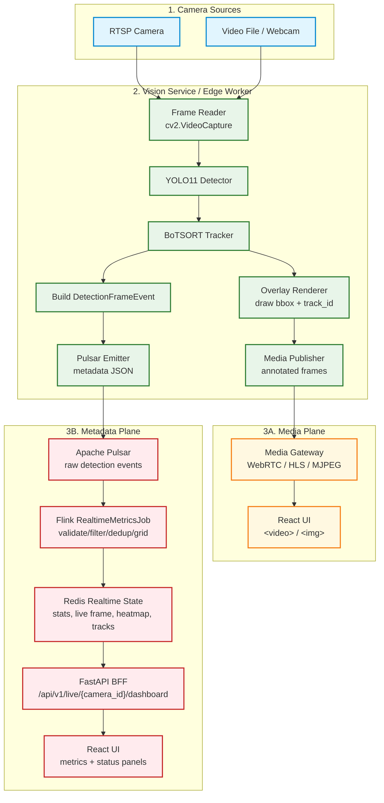
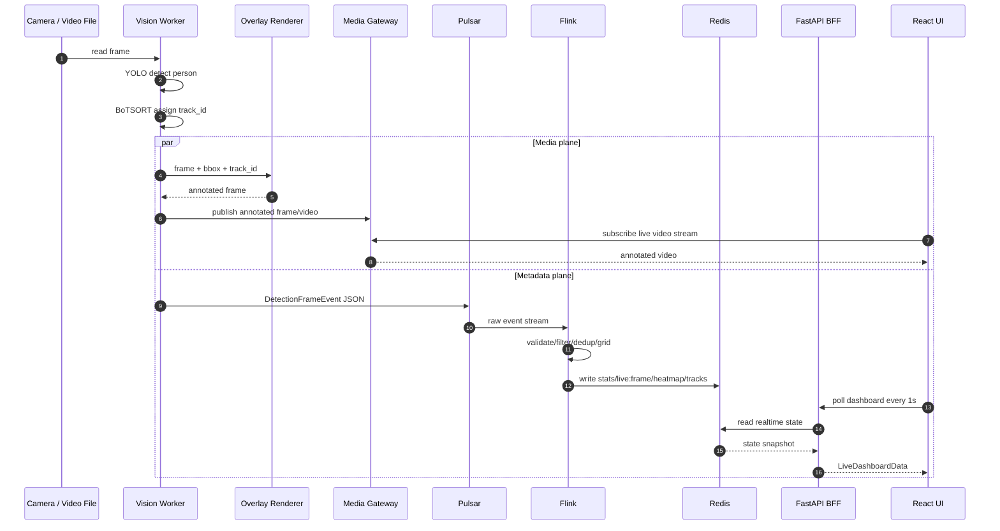
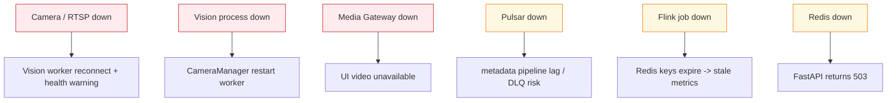

# 06 — Realtime Video Serving Architecture for Dashboard UI

Tài liệu này mô tả kiến trúc realtime video cho dashboard sau khi chọn **Option 1: Vision burn-in overlay vào video stream, UI chỉ hiển thị video đã annotate**.

Mục tiêu chính: dashboard phải xem được live video camera và đồng thời hiển thị metrics realtime từ data stream. Video và metadata là hai luồng khác nhau, không nên ép chung vào Redis/Flink.

---

## 1. Kết luận kiến trúc

Kiến trúc nên chốt:

```text
Camera / Video File
-> Vision Service
   -> Media Plane: annotated video stream -> Media Gateway -> React UI
   -> Metadata Plane: DetectionFrameEvent -> Pulsar -> Flink -> Redis -> FastAPI -> React UI
```

Điểm quan trọng:

- UI **không connect trực tiếp vào camera gốc/RTSP URL**.
- UI **không đọc Redis trực tiếp**.
- Redis **không lưu video bytes**.
- Flink **không xử lý video frame**.
- Vision là nơi duy nhất decode frame, detect, track và vẽ bbox lên frame cho Option 1.
- FastAPI vẫn là BFF cho metrics, health, count, heatmap, active tracks.

---

## 2. Vì sao tách Media Plane và Metadata Plane?

Hệ thống video analytics có hai loại dữ liệu với đặc tính rất khác nhau.

| Plane | Dữ liệu | Latency | Transport phù hợp | Storage/State |
|-------|---------|---------|-------------------|---------------|
| **Media Plane** | video frames, annotated video | rất thấp, liên tục | WebRTC, HLS/LL-HLS, MJPEG dev | không qua Redis/Flink |
| **Metadata Plane** | detection event, count, bbox metadata, heatmap | thấp nhưng nhỏ | Pulsar, Redis, REST/WebSocket | Redis TTL + lakehouse path |

Nếu đưa video vào Redis/Flink/FastAPI REST như metadata thì sẽ sai vai trò:

- Redis không phù hợp để giữ stream frame liên tục.
- Flink không nên decode/encode video.
- REST polling không phù hợp cho frame-rate video.
- Browser không nên biết credential camera.

---

## 3. Sơ đồ tổng thể Option 1



---

## 4. Luồng xử lý một frame



Trong Option 1, bbox hiển thị trên video được vẽ trực tiếp vào frame bởi Vision. UI không cần sync bbox frame-by-frame qua WebSocket trong phase đầu.

---

## 5. Trách nhiệm từng component

### 5.1 Camera / Video Source

- Cung cấp video thô: RTSP, webcam hoặc video file.
- Không expose trực tiếp ra browser.
- Credential/IP camera chỉ nằm trong backend/edge environment.

### 5.2 Vision Service

Vision Service là điểm tách luồng:

1. **Media output**
   - Nhận frame thô.
   - Detect và track.
   - Vẽ bbox, track ID, confidence hoặc label lên frame.
   - Đẩy annotated stream sang Media Gateway.

2. **Metadata output**
   - Build `DetectionFrameEvent` chứa `bbox`, `bbox_norm`, `centroid_norm`, `track_id`, `confidence`, `frame_index`, `capture_ts`.
   - Publish event vào Pulsar để data pipeline xử lý.

Vision không nên gọi Redis trực tiếp trong realtime data path. Redis write vẫn để Flink đảm nhiệm.

### 5.3 Media Gateway

Media Gateway là lớp phục vụ video cho UI.

Nó có thể triển khai bằng một trong các protocol:

| Protocol | Khi dùng | Ưu điểm | Nhược điểm |
|----------|----------|---------|------------|
| **WebRTC** | live monitoring latency thấp | latency thấp, phù hợp realtime | triển khai phức tạp hơn |
| **LL-HLS/HLS** | nhiều người xem, scale tốt | browser/CDN friendly | latency cao hơn WebRTC |
| **MJPEG** | local dev/demo nhanh | dễ làm, dễ debug | tốn bandwidth, không nên là production cuối |

Khuyến nghị:

- MVP local: MJPEG hoặc HLS đơn giản.
- Production live monitoring: WebRTC hoặc LL-HLS.

### 5.4 Pulsar/Flink/Redis/FastAPI

Đây là metadata plane hiện có:

```text
DetectionFrameEvent -> Pulsar -> Flink -> Redis -> FastAPI -> UI metrics
```

Vai trò:

- Pulsar giữ raw metadata event.
- Flink validate/filter/dedup/tính grid heatmap.
- Redis giữ state TTL ngắn: count, latest frame metadata, heatmap, active tracks.
- FastAPI map Redis sang `LiveDashboardData` cho UI.

### 5.5 React UI

UI lấy dữ liệu từ hai nguồn backend-controlled:

```text
VideoPanel video source -> Media Gateway
Metric panels -> FastAPI BFF
```

UI không cần biết:

- RTSP camera URL.
- Redis host/port.
- Pulsar topic.
- Flink job internals.

---

## 6. UI integration model

UI nên có hai connection độc lập:

```text
1. Video stream connection
   GET /media/live/{camera_id}/stream
   hoặc WebRTC signaling endpoint

2. Metadata dashboard connection
   GET /api/v1/live/{camera_id}/dashboard
   polling mỗi 1 giây trong phase hiện tại
```

Ví dụ conceptual layout:

```text
VideoPanel
  src = Media Gateway stream URL
  displays annotated video already containing bbox/track labels

LiveMetricCards / ZoneHeatmap / PipelineHealth
  data = FastAPI LiveDashboardData from Redis
```

Vì bbox đã burn-in trong video, UI phase đầu không cần vẽ bbox overlay bằng canvas. Nếu muốn tương tác nâng cao sau này, có thể chuyển sang Option 2: clean video + metadata WebSocket overlay.

---

## 7. Đồng bộ video và metadata trong Option 1

Option 1 giảm yêu cầu sync phức tạp:

- Bbox/track label đã nằm trong video frame.
- Metrics lấy từ Redis có thể trễ hơn video một chút nhưng vẫn đủ cho dashboard tổng quan.
- `capture_ts` và `frame_index` vẫn cần giữ trong metadata để debug latency và freshness.

Các trạng thái nên hiển thị:

| Trạng thái | Cách xác định |
|------------|---------------|
| Video online | Media Gateway stream đang phát frame |
| Metadata fresh | `now - live:frame.capture_ts <= threshold` |
| Metadata stale | `live:frame` hết TTL hoặc capture_ts quá cũ |
| Redis unavailable | FastAPI trả `503` |
| Camera unavailable | Vision worker không đọc được frame / Media Gateway không có stream |

---

## 8. Failure modes cần thiết kế



Dashboard cần phân biệt rõ:

- Video lỗi nhưng metadata còn stale.
- Metadata lỗi nhưng video vẫn đang phát.
- Cả video và metadata đều lỗi.

Không nên dùng mock data để che các lỗi này trong production.

---

## 9. Lộ trình triển khai đề xuất

### Phase 1 — Annotated video MVP

- Thêm overlay renderer trong Vision worker nếu chưa có path phục vụ live annotated frames.
- Tạo Media Gateway đơn giản cho local/dev: MJPEG hoặc HLS.
- UI `VideoPanel` dùng stream URL từ Media Gateway.
- Metrics vẫn đi qua FastAPI Redis endpoint hiện tại.

Output mong muốn:

```text
React UI hiển thị được video đã có bbox/track_id burn-in
và metrics realtime từ Redis/FastAPI
```

### Phase 2 — Production media serving

- Chuẩn hóa Media Gateway thành WebRTC hoặc LL-HLS.
- Thêm auth cho stream endpoint.
- Thêm fan-out để nhiều UI client xem cùng camera mà không kéo trực tiếp từ camera.
- Thêm health endpoint cho media stream.

### Phase 3 — Advanced interactive overlay nếu cần

Chỉ làm khi cần UI tương tác với bbox/track:

```text
clean video stream + metadata WebSocket + canvas overlay
```

Khi đó cần giải quyết sync theo `frame_index` hoặc `capture_ts`. Đây là Option 2, không phải phase bắt buộc cho MVP production.

---

## 10. Quyết định kiến trúc

| Câu hỏi | Quyết định |
|---------|------------|
| UI có connect thẳng RTSP/camera không? | Không |
| UI lấy video từ đâu? | Media Gateway |
| UI lấy metrics từ đâu? | FastAPI BFF |
| Redis có lưu video không? | Không |
| Flink có xử lý frame/video không? | Không |
| Bbox trên video phase đầu vẽ ở đâu? | Vision Service burn-in vào frame |
| Có dùng mock fallback khi production lỗi không? | Không |
| Có cần WebSocket metadata ngay không? | Chưa, vì Option 1 đã burn-in bbox |

Kiến trúc này giữ đúng boundary của hệ thống data stream: metadata đi qua Pulsar/Flink/Redis, còn video đi qua media serving layer chuyên trách.
