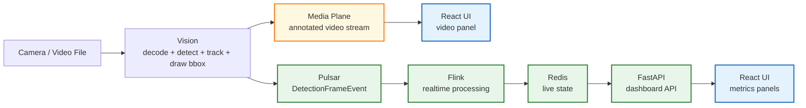
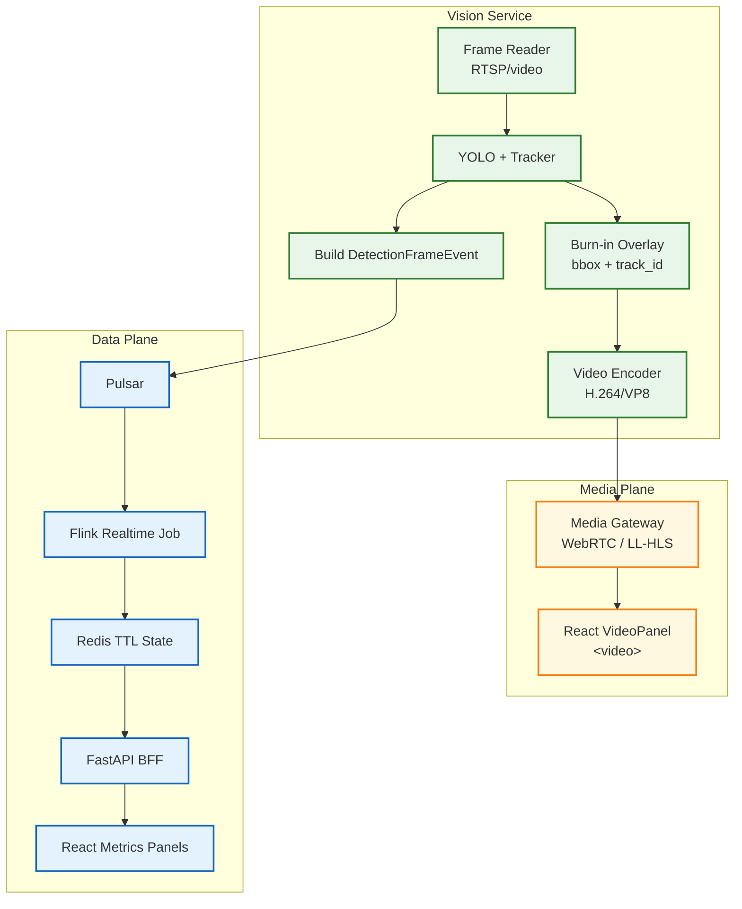

# 07 — Video UI Realtime Smoothness Solution

Tài liệu này mô tả cách xử lý vấn đề video trên dashboard bị lag trong kiến trúc hiện tại.

Phạm vi chỉ tập trung vào **media plane phục vụ video UI**. Luồng data realtime vẫn giữ nguyên:

```text
Vision -> Pulsar -> Flink -> Redis -> FastAPI -> React metrics
```

Video không nên đi qua Redis/Flink. Redis/Flink chỉ xử lý metadata, count, heatmap, active tracks và alert.

---

## 1. Hiện trạng implementation

Branch hiện tại đã triển khai MVP cho live video:

```text
Vision Worker
  -> YOLO + tracker
  -> vẽ bbox/track_id lên frame
  -> encode JPEG
  -> ghi latest frame vào runtime/live_frames/{camera_id}.jpg
  -> FastAPI đọc file JPEG
  -> expose MJPEG stream /media/live/{camera_id}/stream
  -> React VideoPanel hiển thị bằng 
```

Các file chính:

| Component | File | Vai trò |
|----------|------|---------|
| Vision live publisher | `services/vision/media/live_frame_publisher.py` | Encode frame đã annotate thành JPEG và ghi latest frame |
| Vision worker | `services/vision/worker.py` | Detect, track, render overlay, gọi live publisher |
| Source reader | `services/vision/reader.py` | Đọc video/camera, queue nhỏ, drop frame cũ |
| FastAPI media route | `services/api/src/rva_api/api/media/live_video.py` | Serve JPEG latest frame thành MJPEG stream |
| React video panel | `frontend/src/features/live/components/VideoPanel.tsx` | Hiển thị stream URL bằng thẻ `` |
| Camera config | `configs/cameras.yaml` | Cấu hình `live_media_fps`, `live_media_jpeg_quality`, model, queue |

Luồng này đúng cho MVP/local dev, nhưng chưa phải media serving tối ưu cho production.

---

## 2. Vì sao UI video có thể bị lag?

Video web hiện tại khác bản OpenCV cũ.

### 2.1 Bản OpenCV cũ

```text
Vision process
  -> read frame
  -> detect/track
  -> draw bbox in memory
  -> cv2.imshow(frame)
```

Frame không rời khỏi RAM của process Vision. Không có HTTP, không browser, không file I/O, không network transport.

### 2.2 Bản Web hiện tại

```text
Vision
  -> frame.copy()
  -> draw overlay
  -> JPEG encode
  -> write file
  -> FastAPI poll file mtime
  -> read bytes
  -> HTTP multipart MJPEG
  -> browser decode JPEG
  -> render 
```

Các điểm có thể gây lag:

| Điểm nghẽn | Nguyên nhân |
|-----------|-------------|
| Model inference chậm | `yolo11l.pt` nặng, đặc biệt khi chạy CPU hoặc nhiều camera |
| JPEG encode tốn CPU | Mỗi frame là một ảnh JPEG độc lập |
| File bridge | Vision ghi file, FastAPI đọc file liên tục |
| MJPEG over HTTP | Không dùng video codec, bandwidth cao hơn H.264/VP8 |
| Browser decode nhiều JPEG | Mỗi frame decode riêng |
| Poll interval | FastAPI đang poll file theo chu kỳ |
| Client/network chậm | Nếu không drop frame đúng cách sẽ tích lũy latency |

Vì vậy MJPEG có thể nhìn như video, nhưng bản chất là chuỗi ảnh JPEG.

---

## 3. Nguyên tắc kiến trúc cần giữ



Quyết định quan trọng:

- Video bytes không đưa vào Redis.
- Flink không xử lý video frame.
- UI không connect trực tiếp RTSP/camera.
- Vision là nơi tạo annotated frame/video.
- Media stream và metrics API là hai connection độc lập.
- Nếu component lỗi trong production, hiển thị lỗi/stale state; không fallback mock.

---

## 4. Đánh giá các phương án tối ưu

### 4.1 Tiếp tục MJPEG nhưng tune lại

Đây là hướng ngắn hạn vì code hiện tại đã có.

```text
Vision -> latest JPEG file -> FastAPI MJPEG -> React 
```

Ưu điểm:

- Dễ debug.
- Không cần thay đổi lớn frontend.
- Dùng được cho local demo và giai đoạn kiểm thử pipeline.

Nhược điểm:

- Mỗi frame encode/decode JPEG riêng.
- Tốn bandwidth hơn video codec.
- File bridge tạo thêm I/O.
- Không tối ưu cho nhiều viewer.

Khi dùng:

- Local demo.
- Một vài camera.
- Một vài client dashboard.
- Chưa cần latency rất thấp.

Tune nên làm:

| Config | Gợi ý | Lý do |
|--------|-------|-------|
| `live_media_fps` | 10-15 | 10 FPS ổn cho MVP, 15 FPS mượt hơn nếu máy chịu được |
| `live_media_jpeg_quality` | 70-80 | Giảm size frame và CPU encode |
| `frame_queue_size` | 1-2 | Giữ latest frame, tránh backlog |
| `model_name` | `yolo11n.pt` hoặc `yolo11s.pt` nếu lag | Model nhẹ hơn cho realtime |
| `RVA_LIVE_MEDIA_POLL_INTERVAL_SEC` | 0.04-0.08 nếu FPS > 10 | FastAPI poll kịp frame mới |

Không nên tăng FPS nếu model inference không theo kịp. Khi inference chậm, tăng FPS chỉ làm tăng CPU/I/O và dễ lag hơn.

---

### 4.2 WebSocket binary JPEG + Canvas

Phương án trung gian:

```text
Vision -> latest JPEG/in-memory queue size 1 -> FastAPI WebSocket -> React canvas
```

Frontend nhận binary `ArrayBuffer`, tạo `Blob` hoặc `ImageBitmap`, sau đó vẽ lên `<canvas>`.

Ưu điểm:

- Kiểm soát drop frame tốt hơn MJPEG.
- Có thể gửi metadata media nhỏ kèm frame.
- Không cần HTTP multipart.
- Dễ implement hơn WebRTC.

Nhược điểm:

- Vẫn là JPEG từng frame, không phải video codec.
- Vẫn chạy trên TCP.
- Browser vẫn decode từng ảnh.
- FastAPI vẫn gánh media fan-out nếu nhiều client.

Khi dùng:

- Muốn cải thiện nhanh hơn MJPEG.
- Cần kiểm soát latest-frame/drop-frame rõ ràng.
- Chưa đủ thời gian triển khai WebRTC.

Thiết kế bắt buộc:

```text
Queue size = 1
Policy = overwrite latest frame
Client chậm = drop frame cũ, không buffer
```

Không dùng Redis Streams/PubSub cho JPEG frame. Nếu dùng WebSocket, frame nên đi từ Vision/media service hoặc memory queue/media gateway, không qua Redis.

---

### 4.3 WebRTC

Phương án chuẩn cho realtime video production:

```text
Vision
  -> annotated frame
  -> video encoder H.264/VP8
  -> WebRTC Media Gateway
  -> Browser <video>
```

Ưu điểm:

- Latency thấp.
- Browser decode video native.
- Có congestion control.
- Dùng video codec hiệu quả hơn JPEG frame sequence.
- Phù hợp live monitoring.

Nhược điểm:

- Cần signaling.
- Cần xử lý session/viewer.
- Cần media gateway hoặc service chuyên trách.
- Phức tạp hơn MJPEG/WebSocket.

Khi dùng:

- Production dashboard.
- Cần video mượt và latency thấp.
- Nhiều camera hoặc nhiều client.
- Cần đường media tách biệt khỏi FastAPI API server.

Khuyến nghị production:

```text
FastAPI: auth, camera list, dashboard state, signaling metadata nếu cần
Media Gateway: WebRTC/HLS stream fan-out
Vision: publish annotated video vào gateway
React: <video> nhận stream, metrics lấy từ FastAPI
```

Không nên biến FastAPI thành media server chính khi scale production. `aiortc` có thể dùng cho prototype, nhưng media gateway riêng sẽ rõ boundary hơn.

---

### 4.4 LL-HLS/HLS

Phương án phù hợp khi nhiều người xem hơn là latency cực thấp.

```text
Vision -> annotated stream -> segment encoder -> HLS/LL-HLS -> Browser/CDN
```

Ưu điểm:

- Scale tốt.
- Browser/CDN friendly.
- Dễ cache/fan-out hơn WebRTC.

Nhược điểm:

- Latency thường cao hơn WebRTC.
- Không lý tưởng nếu cần phản ứng tức thì theo camera.

Khi dùng:

- Monitoring không yêu cầu sub-second latency.
- Nhiều viewer.
- Cần vận hành đơn giản hơn WebRTC ở quy mô lớn.

---

## 5. Cơ chế drop frame bắt buộc

Realtime video phải ưu tiên frame mới nhất.

Không đúng:

```text
frame 1 -> frame 2 -> frame 3 -> ... -> frame 200
client chậm vẫn phải xem đủ mọi frame
=> video càng chạy càng trễ so với thực tế
```

Đúng:

```text
Nếu client hoặc inference chậm:
  bỏ frame cũ
  giữ frame mới nhất
  latency không tích lũy
```

Trong source reader hiện tại đã có hướng đúng:

```text
queue maxsize nhỏ
queue đầy -> get_nowait() bỏ frame cũ -> put frame mới
```

Với media serving cũng phải giữ cùng nguyên tắc:

| Layer | Chính sách |
|-------|------------|
| Camera reader | queue size 1-2, drop oldest |
| Vision inference | xử lý latest frame có sẵn |
| MJPEG/WebSocket publisher | không backlog nhiều frame |
| Browser client | chậm thì bỏ frame, không replay |

---

## 6. FPS throttling

Không nên cố đẩy 25-30 FPS qua UI nếu model hoặc media path không chịu nổi.

Gợi ý:

| Mục tiêu | FPS |
|----------|-----|
| Dashboard overview MVP | 8-10 FPS |
| Live monitoring tương đối mượt | 12-15 FPS |
| Production realtime video | 15-25 FPS với WebRTC/video codec |

Với MJPEG, 10-15 FPS thường hợp lý hơn 25 FPS vì mỗi frame là một JPEG độc lập.

FPS cần được throttle ở Vision media output, không nhất thiết bằng FPS đọc camera. Ví dụ:

```text
Camera/video source: 25 FPS
Vision inference: xử lý theo khả năng máy
Media publish: 10-15 FPS
Metadata event: theo processed frame
Metrics UI poll: 1 giây
```

---

## 7. Roadmap khuyến nghị cho project

### Phase 1 — Tune MVP hiện tại

Mục tiêu: xác định bottleneck và làm MJPEG ổn cho local demo.

Việc nên làm:

1. Đo processed FPS của Vision.
2. Đo media publish FPS.
3. Đo JPEG size trung bình.
4. Đo latency từ `capture_ts` đến UI.
5. Tune `live_media_fps`, `jpeg_quality`, `frame_queue_size`.
6. Nếu dùng `yolo11l.pt` bị chậm, thử `yolo11s.pt` hoặc `yolo11n.pt`.

Config đề xuất ban đầu:

```yaml
settings:
  model_name: yolo11s.pt
  frame_queue_size: 1
  live_media_fps: 12
  live_media_jpeg_quality: 75
```

Env cho FastAPI media route:

```bash
RVA_LIVE_MEDIA_POLL_INTERVAL_SEC=0.06
```

### Phase 2 — Bỏ file bridge nếu MJPEG vẫn lag

Mục tiêu: giảm I/O và kiểm soát drop frame tốt hơn.

Hướng triển khai:

```text
Vision publishes latest encoded frame to in-memory media service
FastAPI/WebSocket or dedicated media service pushes latest frame to UI canvas
Queue size = 1
Drop stale frame always
```

Đây vẫn là JPEG-based streaming, nhưng tốt hơn file polling.

### Phase 3 — WebRTC production

Mục tiêu: video UI realtime mượt và đúng media architecture.

Hướng triển khai:

```text
Vision -> annotated frame -> encoder -> WebRTC Media Gateway -> React <video>
FastAPI -> dashboard API + auth + camera metadata
Flink/Redis -> realtime metrics
```

Đây là hướng nên chốt nếu dashboard là sản phẩm production thật.

Implementation hiện tại trong repo đi theo hướng incremental:

```text
Vision -> annotated latest JPEG -> FastAPI WebRTC gateway -> React <video>
```

FastAPI đóng vai trò WebRTC gateway prototype bằng endpoint:

```text
POST /media/live/{camera_id}/webrtc/offer
```

React `VideoPanel` ưu tiên WebRTC. Nếu WebRTC chưa sẵn sàng hoặc offer thất bại, UI tự fallback về MJPEG:

```text
GET /media/live/{camera_id}/stream
```

Điểm này giữ hệ thống chạy được trong local/dev trong khi vẫn chuyển browser từ `` MJPEG sang `<video>` WebRTC làm primary transport. Bước production tiếp theo là thay latest-JPEG bridge bằng media gateway chuyên trách nhận annotated stream trực tiếp từ Vision encoder.

---

## 8. Kiến trúc đích production



---

## 9. Quyết định cuối

| Vấn đề | Quyết định |
|--------|------------|
| Có đổi toàn bộ kiến trúc data không? | Không |
| Có cần tách video khỏi Redis/Flink không? | Có, và hiện tại đã đi đúng hướng |
| UI có nên connect thẳng camera không? | Không |
| Bbox nên vẽ ở đâu? | Vision Service burn-in vào frame/video |
| MJPEG hiện tại dùng được không? | Dùng được cho MVP/local demo |
| MJPEG có phải production tối ưu không? | Không |
| WebSocket có phải bước trung gian tốt không? | Có, nếu cần cải thiện nhanh |
| WebRTC có phải hướng production chuẩn không? | Có |
| Có dùng Redis Pub/Sub/Streams để truyền JPEG không? | Không khuyến nghị |
| Có cần drop frame không? | Bắt buộc |
| Có nên tăng FPS vô hạn để mượt hơn không? | Không, phải theo năng lực inference/encode/network |

Kết luận: kiến trúc data stream hiện tại không cần thay đổi lớn. Phần cần nâng cấp là **media serving layer**. Trước mắt tune MJPEG và đo bottleneck; sau đó nếu cần mượt thật cho production thì chuyển media plane sang WebRTC hoặc LL-HLS, còn Redis/Flink/FastAPI tiếp tục phục vụ metadata realtime.
