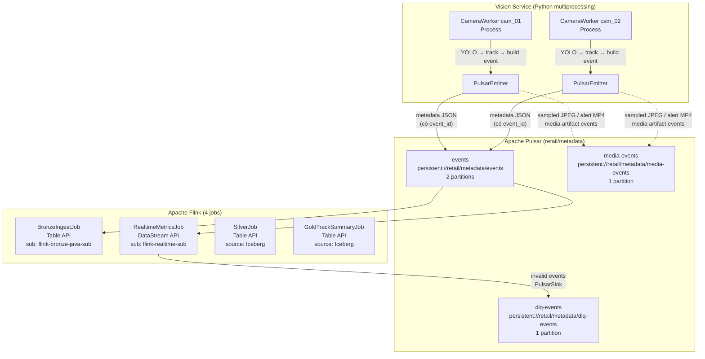
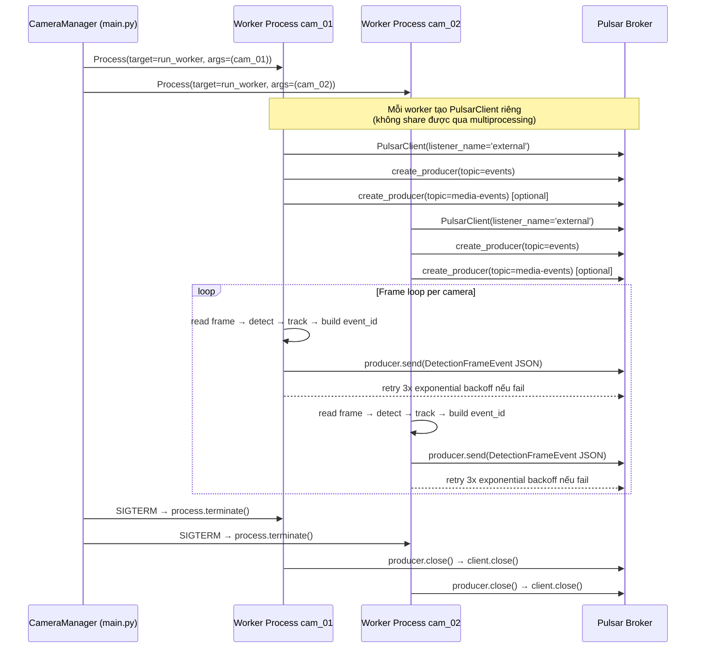
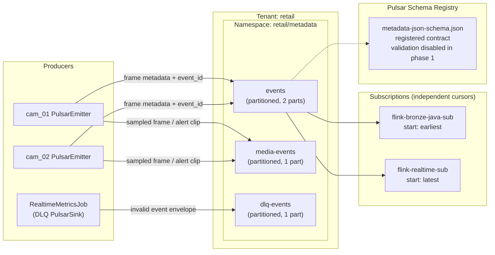
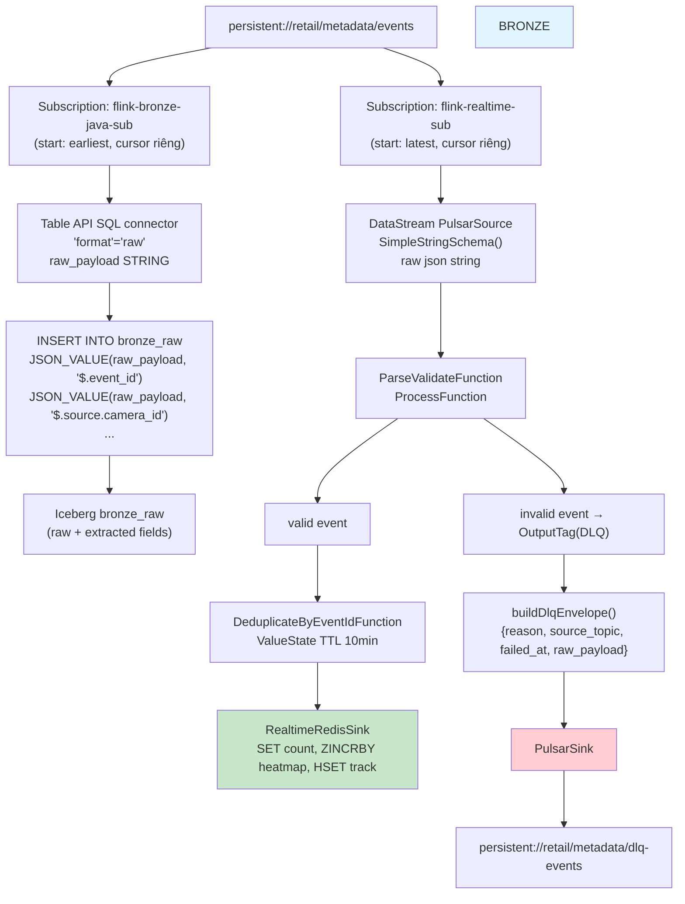
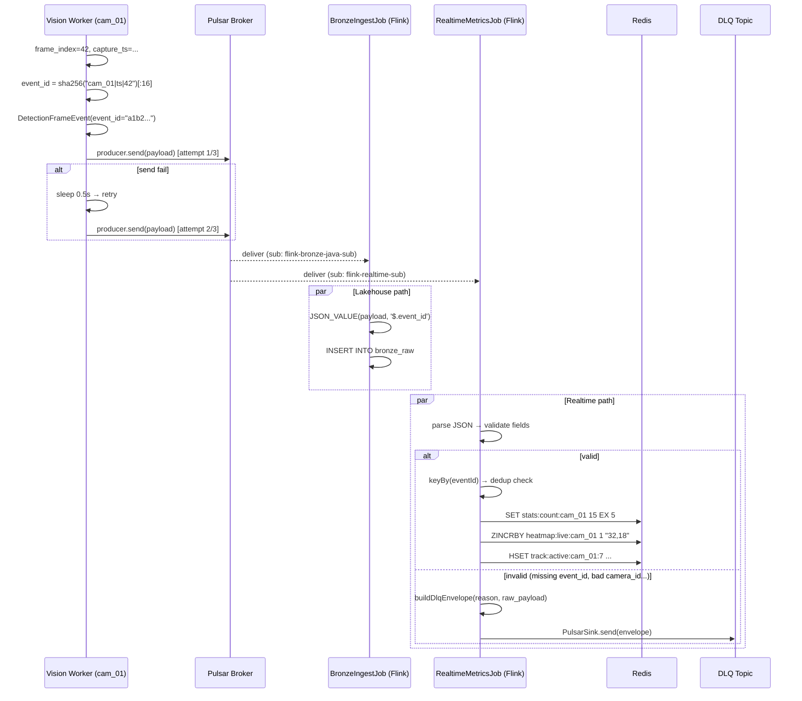

# Pulsar Flow — Multi-Camera Vision → Flink Dual-Path

> Cách Apache Pulsar kết nối Vision module (multi-camera) với Flink processing (dual-path) trong RVA.

---

## 1. Tổng quan — Pulsar là trung tâm



---

## 2. Vision → Pulsar: 1 camera = 1 producer



---

## 3. Pulsar internals: topics, subscriptions, message flow



### Cursor hoạt động độc lập

```
                    Pulsar Topic events
                    ┌────┬────┬────┬────┬────┬────┐
                    │ E1 │ E2 │ E3 │ E4 │ E5 │ E6 │  ...
                    └────┴────┴────┴────┴────┴────┘
                              ▲              ▲
                              │              │
    flink-bronze-java-sub ────┘              │  (đọc từ earliest, đuổi dần)
    flink-realtime-sub ──────────────────────┘  (đọc từ latest, chỉ event mới)
```

Mỗi subscription có **cursor riêng** → Bronze đọc toàn bộ lịch sử, Realtime chỉ đọc event mới.

---

## 4. Pulsar → Flink: 2 source, 2 subscription



---

## 5. Message lifecycle — từ Vision đến Flink



---

## 6. DLQ envelope format

```json
{
    "schema_version": "1.0",
    "event_type": "invalid_detection_event",
    "reason": "missing required field: event_id",
    "source_topic": "persistent://retail/metadata/events",
    "failed_at": "2026-05-17T10:30:05.123Z",
    "raw_payload": "{\"schema_version\":\"1.0\",\"pipeline_run_id\":\"abc123\",...}"
}
```

| Field | Ý nghĩa |
|-------|--------|
| `reason` | Tại sao event bị reject |
| `source_topic` | Topic gốc của event |
| `failed_at` | Thời điểm Flink reject |
| `raw_payload` | JSON gốc (để debug/replay) |

---

## 7. Key takeaways

| Nguyên tắc | Chi tiết |
|------------|---------|
| **1 camera = 1 PulsarClient** | Multiprocessing không share được Pulsar client |
| **Tất cả camera → 1 topic** | Flink keyed by `camera_id` để tách luồng |
| **2 subscription = 2 cursor độc lập** | Bronze đọc từ `earliest`, Realtime từ `latest` |
| **Lakehouse path = Table API** | SQL connector, không code Java Pulsar |
| **Realtime path = DataStream API** | PulsarSource builder + PulsarSink cho DLQ |
| **DLQ = PulsarSink thật** | Không chỉ log, publish vào `dlq-events` topic |
| **event_id = SHA256 deterministic** | Sinh ở Vision, dùng cho dedup ở Flink |
