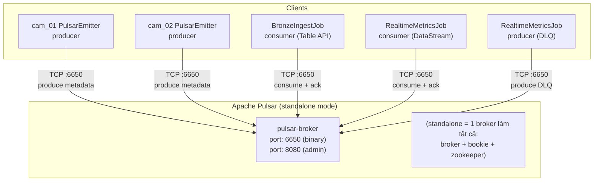
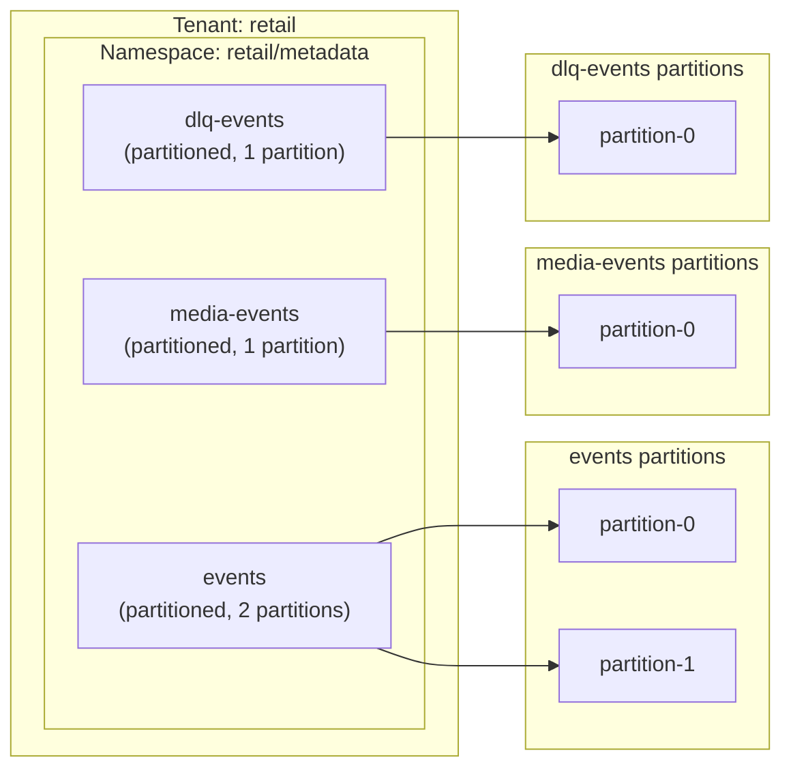
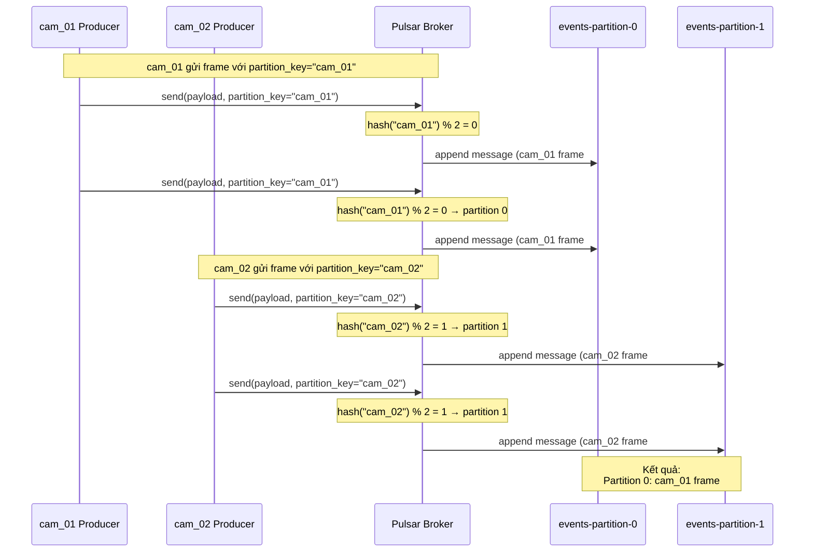
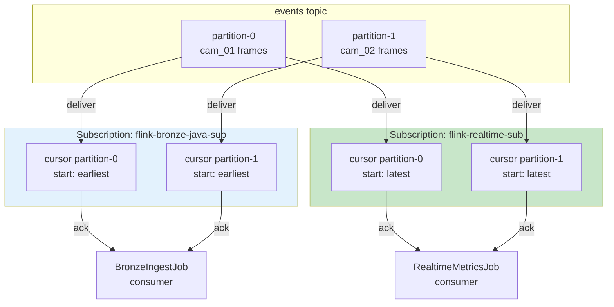
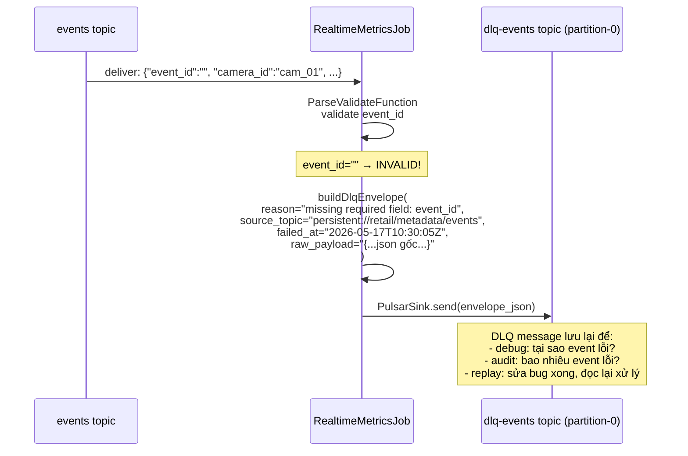
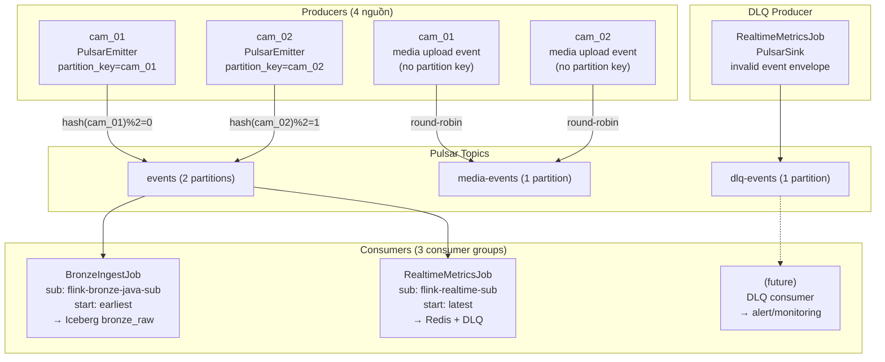

# Pulsar Architecture — Topics, Partitions, Broker & Message Routing

> Cách Pulsar tổ chức tenant/namespace/topic/partition, cách Vision producer route message theo `partition_key`, và cách Flink consumer nhận message từ subscription độc lập.

---

## 1. Pulsar cluster — single broker (standalone mode)



---

## 2. Tenant → Namespace → Topic → Partition hierarchy



---

## 3. Message routing — partition_key quyết định partition



### Công thức routing

```
partition = hash(partition_key) % num_partitions

hash("cam_01") % 2 = partition 0
hash("cam_02") % 2 = partition 1
```

Nếu không set `partition_key`:
```
round_robin:
  frame #1 → partition 0
  frame #2 → partition 1
  frame #3 → partition 0
  → ordering của camera KHÔNG được đảm bảo!
```

---

## 4. Subscription model — 2 consumer, 2 cursor độc lập



### Cursor hoạt động độc lập

```
events topic:
┌──────┬──────┬──────┬──────┬──────┬──────┬──────┐
│  E1  │  E2  │  E3  │  E4  │  E5  │  E6  │ ...  │
└──────┴──────┴──────┴──────┴──────┴──────┴──────┘
        ▲                    ▲
        │                    │
flink-bronze-java-sub ──────┘                    │  (đọc từ earliest, đuổi dần)
flink-realtime-sub ──────────────────────────────┘  (đọc từ latest, chỉ event mới)
```

Mỗi subscription có cursor riêng, độc lập:
- Bronze đọc toàn bộ lịch sử để lưu vào Iceberg
- Realtime chỉ đọc event mới để cập nhật Redis

---

## 5. DLQ flow — invalid event được publish vào topic riêng



---

## 6. Tổng quan toàn bộ luồng message



---

## 7. Key decisions

| Quyết định | Lý do |
|------------|-------|
| **2 partition cho events** | 2 camera → hash(partition_key) phân phối đều, mỗi camera 1 partition, giữ ordering |
| **1 partition cho media-events** | Throughput thấp (~2 msg/s), không cần song song |
| **1 partition cho dlq-events** | Gần như 0 message, chỉ debug/audit |
| **partition_key = camera_id** | Đảm bảo frame của cùng camera luôn vào cùng partition → ordering |
| **2 subscription khác nhau** | Bronze cần toàn bộ lịch sử (earliest), Realtime chỉ cần dữ liệu mới (latest) |
| **DLQ là topic riêng** | Tách biệt invalid event khỏi pipeline chính, dễ monitor |
| **Schema registry trên events** | Phase 1 đăng ký schema contract trong Pulsar; schema validation vẫn disabled để producer raw JSON hiện tại không bị reject |

---

## 8. Scaling lên nhiều camera hơn

```text
4 camera: events -p 4, partition_key=camera_id
  cam_01 → hash % 4 = partition 0
  cam_02 → hash % 4 = partition 1
  cam_03 → hash % 4 = partition 2
  cam_04 → hash % 4 = partition 3

8 camera: events -p 8, partition_key=camera_id
  ... (tương tự, 1 camera = 1 partition)
```

Công thức: `partition_count ≥ camera_count`, set qua env `PULSAR_EVENTS_PARTITIONS`.
