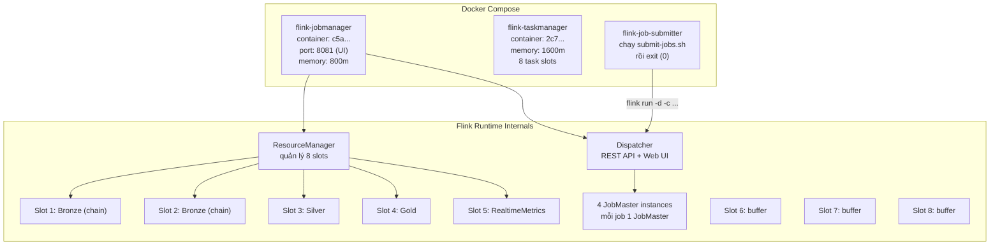
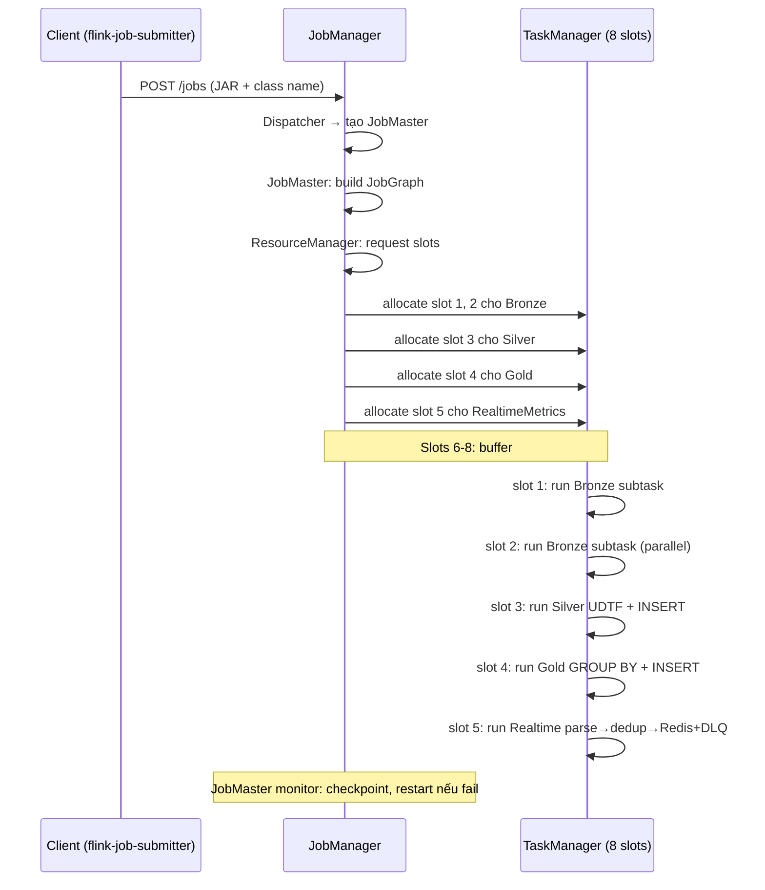
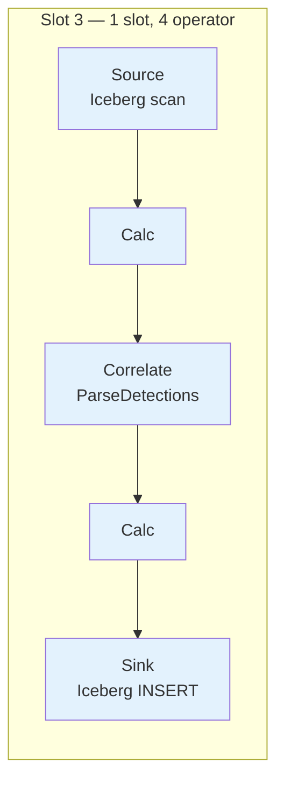
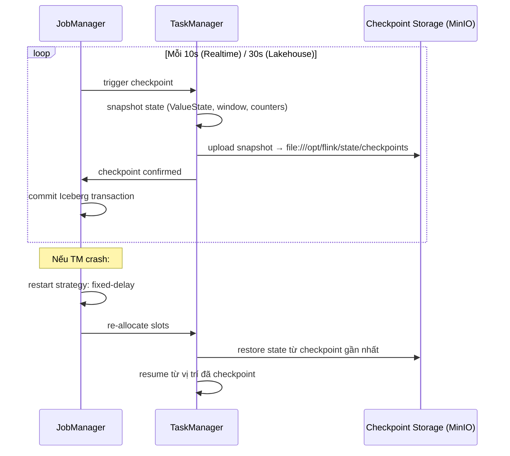

# Flink Architecture — Trong RVA Project

> Cách Flink JobManager, TaskManager, Task Slots, và Parallelism hoạt động trong RVA.
> Tham khảo: https://nightlies.apache.org/flink/flink-docs-stable/docs/concepts/flink-architecture/

---

## 1. Flink Cluster trong RVA — Session Mode (Standalone)



---

## 2. JobManager vs TaskManager — Ai làm gì



| Component | Trong RVA | Vai trò |
|-----------|-----------|--------|
| **JobManager** | 1 container `flink-jobmanager` (800m) | Điều phối 4 jobs, REST API, Web UI, checkpoint coordinator |
| **TaskManager** | 1 container `flink-taskmanager` (1600m, 8 slots) | Chạy thật sự các task: parse JSON, SQL, ghi Iceberg, ghi Redis |
| **Client** | `flink-job-submitter` (exit 0) | Submit 4 jobs rồi exit, không phải runtime |

---

## 3. Task Slots — Đơn vị cấp phát tài nguyên

```
┌──────────────────────────────────────────────────────┐
│        flink-taskmanager (JVM, 1600m heap)            │
│                                                      │
│  ┌──────────┐ ┌──────────┐ ┌──────────┐ ┌──────────┐ │
│  │ Slot 1   │ │ Slot 2   │ │ Slot 3   │ │ Slot 4   │ │
│  │ Bronze   │ │ Bronze   │ │ Silver   │ │ Gold     │ │
│  │ source→  │ │ source→  │ │ UDTF→    │ │ GROUP→   │ │
│  │ insert   │ │ insert   │ │ insert   │ │ upsert   │ │
│  │ 200m     │ │ 200m     │ │ 200m     │ │ 200m     │ │
│  └──────────┘ └──────────┘ └──────────┘ └──────────┘ │
│  ┌──────────┐ ┌──────────┐ ┌──────────┐ ┌──────────┐ │
│  │ Slot 5   │ │ Slot 6   │ │ Slot 7   │ │ Slot 8   │ │
│  │Realtime  │ │ buffer   │ │ buffer   │ │ buffer   │ │
│  │parse→    │ │ (trống)  │ │ (trống)  │ │ (trống)  │ │
│  │dedup→    │ │          │ │          │ │          │ │
│  │Redis+DLQ │ │          │ │          │ │          │ │
│  │ 200m     │ │ 200m     │ │ 200m     │ │ 200m     │ │
│  └──────────┘ └──────────┘ └──────────┘ └──────────┘ │
│                                                      │
│  Mỗi slot: ~200m managed memory                      │
│  Không có CPU isolation giữa các slot                │
└──────────────────────────────────────────────────────┘
```

### Tại sao Bronze cần 2 slots mà Silver chỉ cần 1?

```
Bronze: Source (parallelism=1) → Calc (2) → Correlate (2) → Calc (2) → Iceberg Sink
         1 slot                   2 slots (parallel)                    2 slots shared

Silver: Source (Iceberg scan) → Calc (1) → Correlate UDTF (1) → Calc (1) → Iceberg Sink
         1 slot                                                         1 slot (slot sharing)
```

Bronze `Correlate` operator có **parallelism=2** → cần 2 slot. Silver toàn bộ chain **parallelism=1** → 1 slot đủ nhờ **slot sharing**.

---

## 4. Slot Sharing — Tại sao 1 slot chạy được cả pipeline



Slot sharing = tất cả operator trong cùng 1 job, cùng 1 parallelism index có thể chạy trong cùng 1 slot. Đây là lý do 8 slots chạy được 4 jobs mặc dù mỗi job có 4-5 operator.

**Không có slot sharing:** mỗi operator cần slot riêng → 4 jobs × 4 operators = 16 slots cần.

**Có slot sharing:** chỉ cần `max(parallelism)` slots mỗi job → 4 jobs = 5 slots + buffer = 8 slots.

---

## 5. Session Cluster — Đặc điểm của RVA

RVA dùng **Flink Session Cluster** (standalone mode):

```
docker compose up → Flink cluster khởi động → tồn tại đến khi docker compose down
                         │
                    submit 4 jobs
                         │
                    tất cả jobs chạy đồng thời
                    (không cần khởi động cluster mới cho mỗi job)
```

| Đặc điểm | Ý nghĩa với RVA |
|----------|-----------------|
| Cluster tồn tại lâu dài | Khởi động 1 lần, chạy pipeline liên tục |
| Nhiều jobs cùng cluster | 4 jobs chia sẻ 1 TaskManager |
| ResourceManager không tự scale | Không thể thêm TaskManager tự động → phải cấu hình slots thủ công |
| 1 TM crash = tất cả jobs affected | Nếu TaskManager OOM → 4 jobs cùng chết |
| JobManager fatal = toàn bộ cluster sập | Cần restart docker compose |

---

## 6. Công thức tính slots cho RVA

```
slots ≥ max_parallelism_job1 + max_parallelism_job2 + ... + buffer

Hiện tại:
  Bronze:     parallelism 2 (Correlate operator)
  Silver:     parallelism 1
  Gold:       parallelism 1
  Realtime:   parallelism 1
  Buffer:     3 slots
  ─────────────────────────────────
  Tổng:       8 slots
```

Khi scale:
- **Thêm camera**: không tăng jobs → không cần tăng slots
- **Tăng parallelism** (để xử lý nhanh hơn): tăng slots tương ứng
- **Thêm job mới**: +1 slot/job (parallelism 1) hoặc +P slots (parallelism P)

---

## 7. Standalone Mode Limitation — Không Auto-Scale

```text
Flink Session Cluster (standalone):
  ResourceManager chỉ phân phối slots từ TaskManager CÓ SẴN
  KHÔNG thể tự động khởi động TaskManager mới

So với:
  Flink trên Kubernetes:
    ResourceManager → yêu cầu K8s API → tạo Pod TaskManager mới
    → auto-scale theo workload
```

Với Docker Compose, muốn thêm TaskManager: phải thêm service `flink-taskmanager-2` vào docker-compose.yml thủ công. Cho thesis demo, 1 TaskManager 8 slots là đủ.

---

## 8. Checkpoint & Recovery trong Session Cluster



| Setting | Lakehouse | Realtime | Ý nghĩa |
|---------|-----------|----------|--------|
| `execution.checkpointing.interval` | 30s | **10s** | Realtime checkpoint nhanh hơn → ít data loss hơn khi crash |
| `checkpointing.mode` | EXACTLY_ONCE | EXACTLY_ONCE | Iceberg commit atomic; Redis at-least-once |
| `tolerable-failed-checkpoints` | 5 | 5 | Cho phép 5 lần fail liên tiếp trước khi fail job |

---

## 9. Key takeaways

| Khái niệm | Trong RVA |
|-----------|-----------|
| **JobManager** | 1 container (800m), quản lý 4 JobMaster |
| **TaskManager** | 1 container (1600m), 8 slots, chạy tất cả task |
| **Task Slot** | Đơn vị cấp phát managed memory (~200m/slot), không CPU isolation |
| **Slot Sharing** | Cho phép 1 slot chạy toàn bộ pipeline của 1 job |
| **Session Cluster** | Cluster tồn tại lâu dài, nhiều jobs chia sẻ |
| **Standalone Mode** | Không auto-scale TM, phải cấu hình slots thủ công |
| **Parallelism** | Bronze=2 (Correlate), còn lại=1 |
| **Checkpoint** | 10s Realtime, 30s Lakehouse, RocksDB state backend |
