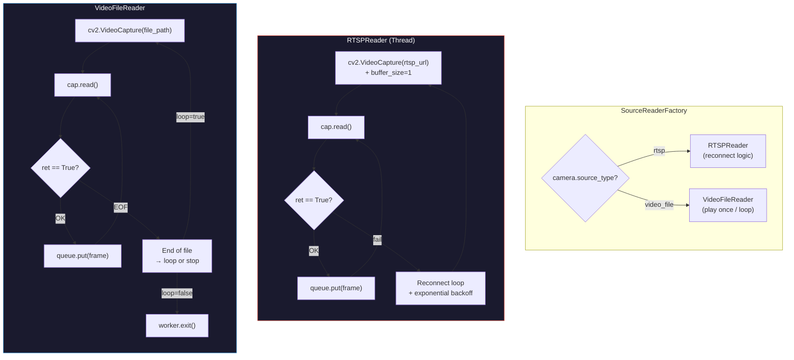
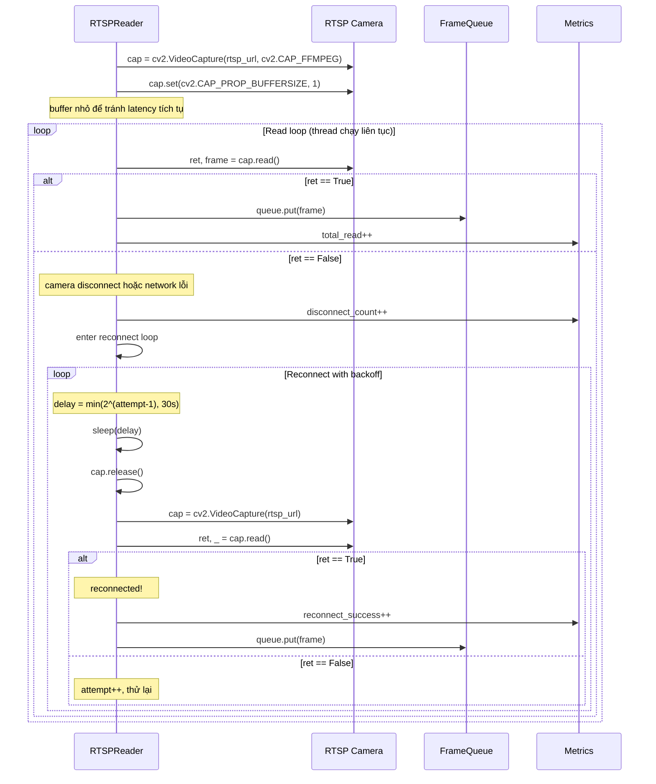
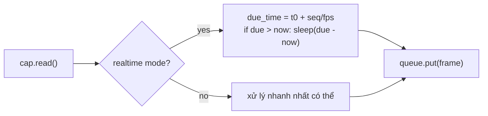

# 03 — Source Readers: RTSP vs Video File

## Hai loại reader — cùng interface, khác behavior

## RTSP: Reconnect flow chi tiết

## So sánh RTSP vs Video File

| Khía cạnh | RTSPReader | VideoFileReader |
|-----------|-----------|-----------------|
| **Nguồn** | `rtsp://ip:port/stream` | `data/videos/sample.mp4` |
| **Buffer** | `CV_CAP_PROP_BUFFERSIZE = 1` | Không cần giới hạn |
| **Reconnect** | Có — exponential backoff 1→30s | Không cần |
| **FPS control** | Theo camera FPS tự nhiên | Dùng `cv2.CAP_PROP_FPS` hoặc sleep để giả lập FPS |
| **End-of-stream** | Không có (stream vô hạn) | Có — loop hoặc exit |
| **Frame drop** | Có thể xảy ra nếu inference chậm | Hiếm khi cần (có thể giả lập FPS) |
| **SIGTERM** | `cap.release()`, close thread | `cap.release()`, cleanup |
| **Dùng trong demo** | Cần camera thật hoặc RTSP server | Dùng video file có sẵn |
| **Dùng trong production** | Camera siêu thị thật | Dùng cho backfill / replay |

## FPS control — Video file giả lập realtime

> **Demo:** `realtime=True` cho video file để giả lập camera thật.  
> **Backfill:** `realtime=False` để xử lý nhanh nhất có thể.
