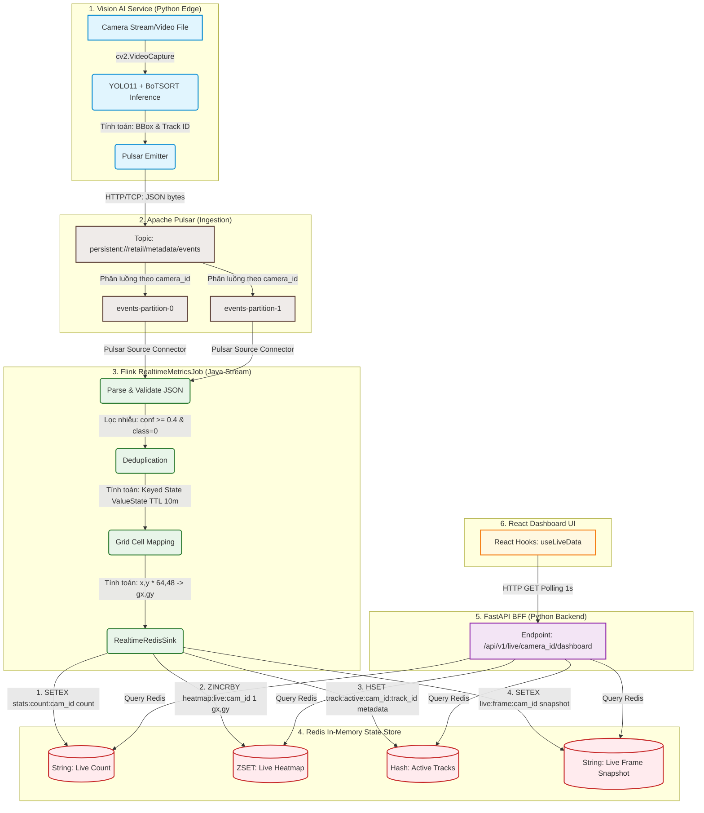

# Real-time Data Flow & Redis State Store in RVA

Tài liệu này giải thích cách dữ liệu di chuyển, biến đổi và được tính toán qua từng công cụ trong luồng xử lý thời gian thực (Real-time Pipeline), tập trung làm rõ vai trò của Flink và Redis.

---

## 1. Sơ đồ Mermaid: Luồng di chuyển và biến đổi của dữ liệu (Data Pipeline)

---

## 2. Chi tiết luồng vận chuyển và biến đổi dữ liệu

### Bước 1: Thu thập và tính toán tại Edge (Vision Service)
*   **Dữ liệu vào (Input)**: Video thô dạng luồng frame (`cv2.VideoCapture`).
*   **Bộ xử lý**: YOLO11 nhận dạng đối tượng (vật thể) + BoTSORT bám vết đối tượng qua từng khung hình.
*   **Tính toán tại đây**:
    *   Chuyển đổi toạ độ Pixel của đối tượng thành toạ độ tương đối (chuẩn hoá về khoảng `[0.0, 1.0]`) đối với khung hình để độc lập với độ phân giải camera:
        $$\text{norm\_x} = \frac{x}{\text{width}}, \quad \text{norm\_y} = \frac{y}{\text{height}}$$
    *   Tính toán Centroid (trọng tâm của Bounding Box) và chuẩn hoá Centroid.
    *   Sinh mã bám vết `track_id` duy nhất cho mỗi người.
*   **Dữ liệu ra (Output)**: Một payload JSON chứa thông tin frame kèm danh sách các đối tượng phát hiện (`DetectionFrameEvent`).

### Bước 2: Truyền tải qua Apache Pulsar
*   **Dữ liệu vào**: Chuỗi JSON bytes gửi từ Python qua giao thức TCP.
*   **Bộ xử lý**: Pulsar Broker.
*   **Tính toán/Định tuyến**:
    *   Pulsar dùng `camera_id` làm **Partition Key** để hash dữ liệu. Dữ liệu của camera 1 luôn vào Partition 0, camera 2 vào Partition 1. Việc này bảo đảm Flink sẽ tiêu thụ dữ liệu theo đúng thứ tự thời gian của từng camera độc lập.
*   **Dữ liệu ra**: Hàng đợi tin nhắn (Message queue) sẵn sàng cho consumer đọc.

### Bước 3: Phân tích và lọc trùng tại Flink
*   **Dữ liệu vào**: Luồng JSON bytes đọc từ Pulsar topic.
*   **Bộ xử lý**: `RealtimeMetricsJob` (chạy trên Flink cluster).
*   **Tính toán tại đây**:
    1.  **Parse & Validate**: Chuyển JSON bytes thành Java Object. Kiểm tra dữ liệu hợp lệ (nếu lỗi sẽ gửi vào DLQ topic). Lọc bỏ các phát hiện nhiễu (chỉ giữ `class_id = 0` (person) và độ tin cậy `confidence >= 0.4`).
    2.  **Deduplication (Chống trùng)**: Lấy `event_id` (được sinh bằng SHA256 dựa trên camera, thời gian, số frame) làm khoá. Flink sử dụng `ValueState<Boolean>` lưu lại các `event_id` đã xử lý trong vòng 10 phút. Nếu gặp lại trùng lặp do mạng chập chờn gửi lại (replay/retry), Flink sẽ loại bỏ.
    3.  **Grid Cell Mapping (Ánh xạ lưới tọa độ)**: Đổi toạ độ centroid chuẩn hoá (`norm_x`, `norm_y` từ `[0.0, 1.0]`) sang ô lưới $64 \times 48$ tương ứng:
        $$gx = \text{clamp}(\text{norm\_x} \times 64, 0, 63)$$
        $$gy = \text{clamp}(\text{norm\_y} \times 48, 0, 47)$$
*   **Dữ liệu ra**: Lệnh cập nhật Redis (được ghi hàng loạt bằng Jedis client thông qua Connection Pool).

### Bước 4: Lưu trữ trạng thái và tổng hợp tại Redis
*   **Dữ liệu vào**: Các câu lệnh ghi `SETEX`, `ZINCRBY`, `HSET` từ Flink.
*   **Bộ xử lý**: Redis In-Memory Engine.
*   **Dữ liệu có được tính toán tại Redis không? CÓ!**
    *   **Live Heatmap (ZSET)**: Khi Flink gọi lệnh `ZINCRBY heatmap:live:{camera_id} 1 "gx,gy"`, Redis thực hiện phép cộng dồn tăng điểm số (score) cho toạ độ ô lưới đó trong bộ nhớ RAM. Redis liên tục duy trì sắp xếp thứ tự các ô lưới có điểm số cao nhất.
    *   **Live Counts (String)**: Flink đếm số người trong frame đó và ghi đè giá trị bằng `SETEX` kèm TTL 5 giây. Phép tính "đếm" (COUNT) thực chất đã được Flink thực hiện trước bằng hàm Java Stream, Redis chỉ lưu trữ trạng thái cuối cùng.
    *   **Live Frame Snapshot (String)**: Ghi nhận snapshot của frame hiện tại `live:frame:{camera_id}` lưu trữ dưới dạng JSON string với TTL 10 giây chứa đầy đủ danh sách detections gồm các toạ độ `bbox_norm` và `centroid_norm` thô từ YOLO để BFF (FastAPI) phục vụ trực tiếp cho React UI vẽ Bounding Box thật.
    *   **Active Tracks (Hash)**: Lưu trữ và cập nhật trạng thái chi tiết của từng track ID. Flink ghi các toạ độ lưới cùng với toạ độ Bounding Box thật (`bbox_x`, `bbox_y`, `bbox_w`, `bbox_h`) và độ tin cậy `confidence` vào Hash `track:active:{camera_id}:{track_id}` với TTL 30 giây. Khi khách hàng rời khỏi cửa hàng, Flink không còn gửi thông tin cập nhật của track đó nữa, sau 30 giây Redis sẽ tự động xoá bỏ Key này để dọn dẹp bộ nhớ.

---

## 3. Tổng kết: Flink vs Redis làm gì?

| Tính năng / Nhiệm vụ | Vai trò của Flink | Vai trò của Redis |
|----------------------|-------------------|-------------------|
| **Lọc và làm sạch** | Loại bỏ phát hiện nhiễu (confidence < 0.4), loại trùng lặp dữ liệu (`event_id` dedup) | Không làm (chỉ nhận dữ liệu đã sạch từ Flink) |
| **Tính toán toạ độ** | Ánh xạ toạ độ thập phân sang chỉ số ô lưới $64 \times 48$ | Không làm (chỉ nhận chuỗi `"gx,gy"`) |
| **Tính toán tích lũy (Aggregation)** | Không làm (Flink chuyển luồng realtime không lưu vết lịch sử tích luồng để đảm bảo độ trễ thấp) | **Có làm** (Cộng dồn tần suất di chuyển bằng Sorted Set `ZINCRBY`) |
| **Quản lý vòng đời dữ liệu** | Gắn nhãn thời gian và watermark để đảm bảo đúng thứ tự sự kiện | **Có làm** (Xoá bỏ các track không hoạt động quá 30s, live frame snapshot quá 10s và live count quá 5s bằng cơ chế TTL) |
| **Độ trễ truy vấn** | Độ trễ xử lý dòng $\approx 10-50$ mili giây | Tốc độ đáp ứng truy vấn đọc/ghi $\approx 1$ mili giây (in-memory) |
