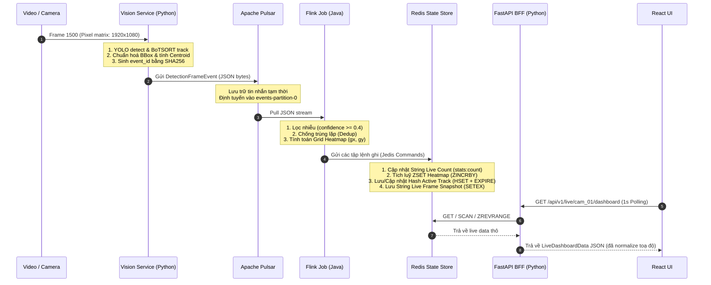

# Ví dụ chuyển đổi dữ liệu của 1 Event qua từng Service (Real-time Pipeline)

Tài liệu này mô tả chi tiết cách **một sự kiện phát hiện đối tượng** (Event) từ khi camera ghi nhận, được tính toán và biến đổi định dạng như thế nào qua từng dịch vụ trong hệ thống.

---

## Kịch bản ví dụ (Scenario)
*   **Camera**: `cam_01` (Cổng vào - Entrance, độ phân giải $1920 \times 1080$).
*   **Sự kiện**: Tại frame số `1500` (thời điểm `2026-05-20T17:01:00.000Z`), camera phát hiện **1 người** đứng ở góc phải bên dưới khung hình.
*   **Mã bám vết (Track ID)**: YOLO + BoTSORT xác định người này mang mã số `42`.
*   **Toạ độ Bounding Box vật lý (Pixel)**:
    *   Góc trái trên: $x_1 = 960$ px, $y_1 = 540$ px.
    *   Góc phải dưới: $x_2 = 1152$ px, $y_2 = 1080$ px.

---

## 1. Biến đổi dữ liệu qua các chặng



---

## 2. Chi tiết dữ liệu tại từng chặng

### Chặng 1: Xử lý tại Vision Service (Python)

#### A. Tính toán toạ độ chuẩn hoá:
*   **Centroid vật lý (Trọng tâm)**:
    *   $cx = \frac{x_1 + x_2}{2} = \frac{960 + 1152}{2} = 1056$ px
    *   $cy = \frac{y_1 + y_2}{2} = \frac{540 + 1080}{2} = 810$ px
*   **Centroid chuẩn hoá (CentroidNorm)**:
    *   $\text{norm\_cx} = \frac{1056}{1920} = 0.55$
    *   $\text{norm\_cy} = \frac{810}{1080} = 0.75$

#### B. Tạo `event_id` chống trùng (Deterministic ID):
*   Chuỗi hash đầu vào: `"cam_01|2026-05-20T17:01:00.000Z|1500"`
*   Kết quả hash SHA256 (lấy 16 ký tự đầu): `"58426736655b6ee8"`

#### C. Cấu trúc dữ liệu JSON gửi đi (DetectionFrameEvent):
```json
{
  "schema_version": "1.0",
  "event_id": "58426736655b6ee8",
  "pipeline_run_id": "run_001",
  "source": {
    "store_id": "store_001",
    "camera_id": "cam_01",
    "stream_id": "cam_01_stream"
  },
  "frame_index": 1500,
  "capture_ts": "2026-05-20T17:01:00.000Z",
  "image_size": {
    "width": 1920,
    "height": 1080
  },
  "runtime": {
    "model_name": "yolo11n.pt",
    "tracker_type": "botsort"
  },
  "detections": [
    {
      "det_id": "1500-0",
      "class": "person",
      "class_id": 0,
      "conf": 0.85,
      "bbox": {
        "x1": 960.0,
        "y1": 540.0,
        "x2": 1152.0,
        "y2": 1080.0
      },
      "bbox_norm": {
        "x": 0.50,
        "y": 0.50,
        "w": 0.10,
        "h": 0.50
      },
      "centroid": {
        "x": 1056.0,
        "y": 810.0
      },
      "centroid_norm": {
        "x": 0.55,
        "y": 0.75
      },
      "track_id": 42
    }
  ]
}
```

---

### Chặng 2: Lưu trữ tại Apache Pulsar
*   Tin nhắn trên được lưu nguyên vẹn dưới dạng mảng Bytes trong phân vùng `persistent://retail/metadata/events-partition-0`.

---

### Chặng 3: Xử lý tại Flink (RealtimeMetricsJob)

Khi Flink kéo tin nhắn về, nó thực hiện các bước xử lý sau:

1.  **Deduplication**: 
    *   Kiểm tra trong `ValueState` của Flink xem có khoá `"58426736655b6ee8"` chưa.
    *   *Kết quả*: Chưa có $\to$ Đánh dấu đã xử lý và tiếp tục luồng.
2.  **Lọc dữ liệu**:
    *   Kiểm tra đối tượng trong `detections`: `class_id = 0` (person) và `conf = 0.85` (thoả mãn điều kiện $\ge 0.4$).
    *   *Kết quả*: Giữ lại đối tượng này.
3.  **Tính toán ô lưới Heatmap ($64 \times 48$)**:
    *   Tính toạ độ lưới X ($gx$):
        $$gx = \text{clamp}(0.55 \times 64, 0, 63) = \text{clamp}(35.2, 0, 63) = 35$$
    *   Tính toạ độ lưới Y ($gy$):
        $$gy = \text{clamp}(0.75 \times 48, 0, 47) = \text{clamp}(36.0, 0, 47) = 36$$
    *   *Kết quả*: Điểm toạ độ lưới thu được là `"35,36"`.

---

### Chặng 4: Cập nhật dữ liệu tại Redis

Flink gửi các lệnh Jedis TCP tới Redis. Trạng thái trong Redis biến đổi tương ứng như sau:

#### Lệnh 1: Cập nhật số người trực tiếp (Live Count)
*   **Lệnh gửi đi**: `SETEX stats:count:cam_01 5 "1"`
*   **Dữ liệu lưu tại Redis**:
    *   Key: `stats:count:cam_01` (Type: String)
    *   Value: `"1"`
    *   Thời gian tồn tại (TTL): 5 giây (sau 5 giây nếu không có frame mới đè lên, key này sẽ biến mất).

#### Lệnh 2: Tích lũy bản đồ nhiệt thời gian thực (Heatmap)
*   **Lệnh gửi đi**: `ZINCRBY heatmap:live:cam_01 1.0 "35,36"` kèm theo `EXPIRE heatmap:live:cam_01 60`
*   **Dữ liệu lưu tại Redis**:
    *   Key: `heatmap:live:cam_01` (Type: Sorted Set)
    *   Member `"35,36"` được cộng thêm 1 vào điểm số hiện tại (ví dụ: từ `20` $\to$ `21`).
    *   Thời gian tồn tại (TTL): Reset về 60 giây.

#### Lệnh 3: Lưu vết hành trình khách hàng đang hoạt động (Active Track)
*   **Lệnh gửi đi**:
    ```redis
    HSET track:active:cam_01:42 \
      last_seen "2026-05-20T17:01:00.000Z" \
      grid_x "35" \
      grid_y "36" \
      bbox_x "0.50" \
      bbox_y "0.50" \
      bbox_w "0.10" \
      bbox_h "0.50" \
      confidence "0.85" \
      store_id "store_001" \
      event_id "58426736655b6ee8"
    EXPIRE track:active:cam_01:42 30
    ```
*   **Dữ liệu lưu tại Redis**:
    *   Key: `track:active:cam_01:42` (Type: Hash)
    *   Fields:
        *   `last_seen`: `"2026-05-20T17:01:00.000Z"`
        *   `grid_x`: `"35"`
        *   `grid_y`: `"36"`
        *   `bbox_x`: `"0.50"`
        *   `bbox_y`: `"0.50"`
        *   `bbox_w`: `"0.10"`
        *   `bbox_h`: `"0.50"`
        *   `confidence`: `"0.85"`
        *   `store_id`: `"store_001"`
        *   `event_id`: `"58426736655b6ee8"`
    *   Thời gian tồn tại (TTL): 30 giây.

#### Lệnh 4: Lưu thông tin snapshot khung hình (Live Frame Snapshot)
*   **Lệnh gửi đi**:
    ```redis
    SETEX live:frame:cam_01 10 "{\"schema_version\":\"1.0\",\"event_id\":\"58426736655b6ee8\",\"camera_id\":\"cam_01\",\"store_id\":\"store_001\",\"frame_index\":1500,\"capture_ts\":\"2026-05-20T17:01:00.000Z\",\"image_size\":{\"width\":1920,\"height\":1080},\"detections\":[{\"track_id\":42,\"label\":\"person\",\"confidence\":0.85,\"bbox_norm\":{\"x\":0.50,\"y\":0.50,\"w\":0.10,\"h\":0.50},\"centroid_norm\":{\"x\":0.55,\"y\":0.75},\"grid_x\":35,\"grid_y\":36}]}"
    ```
*   **Dữ liệu lưu tại Redis**:
    *   Key: `live:frame:cam_01` (Type: String)
    *   Value: Chuỗi JSON snapshot đầy đủ toạ độ của frame.
    *   Thời gian tồn tại (TTL): 10 giây.

