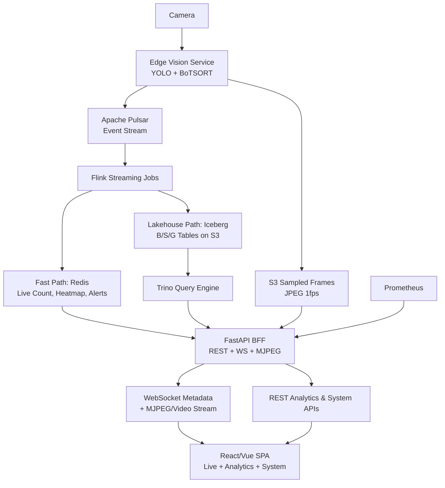

# 📄 VISUALIZATION_MIGRATION_APPROACH.md
## Phương án thay thế lớp Visualization bằng React/Vue SPA
> **Phiên bản:** `1.0` | **Ngày:** `2026-05-07` | **Trạng thái:** `Draft - Ready for Team Review`

---

## 🎯 1. Mục tiêu & Động lực
Hiện tại, tài liệu kiến trúc đề xuất sử dụng **Streamlit (Live Monitor)** + **Grafana (KPI/Ops)**. Phương án mới đề xuất thay thế bằng **một ứng dụng Frontend duy nhất (React hoặc Vue)** để:
- ✅ **Thống nhất trải nghiệm người dùng:** Video realtime, bounding box overlay, biểu đồ analytics, và monitoring hệ thống nằm trong 1 SPA.
- ✅ **Giảm độ trễ hiển thị:** WebSocket + Canvas rendering thay thế polling/rerun của Streamlit, latency mục tiêu `< 100ms`.
- ✅ **Tách lớp rõ ràng (Separation of Concerns):** FastAPI đóng vai trò BFF, Frontend chỉ là consumption layer, pipeline Data Engineering giữ nguyên 100%.
- ✅ **Dễ mở rộng & đóng gói:** Static build, deploy qua Nginx/FastAPI, tích hợp CI/CD chuẩn.

> ⚠️ **Lưu ý trọng tâm đồ án DE:** Frontend chỉ là lớp hiển thị. 80% công sức & tiêu chí chấm điểm vẫn nằm ở `Vision → Pulsar → Flink → Iceberg/Trino → Data Quality/Monitoring`.

---

## 🏗️ 2. Kiến trúc cập nhật



> **Lưu ý:** Trino query **Iceberg tables** (Parquet), không query trực tiếp JPEG từ S3. S3 sampled frames chỉ dùng cho investigation/replay qua FastAPI signed URL.

### 🔁 Thay đổi so với bản cũ

| Thành phần cũ | Thành phần mới | Ghi chú |
|---------------|----------------|---------|
| Streamlit Live Monitor | React/Vue `/live` | WebSocket + Canvas overlay — Streamlit không làm được sync frame-level |
| Grafana KPI | React/Vue `/analytics` | ECharts + Trino proxy — thống nhất UX trong 1 SPA |
| Grafana Ops (Pipeline Health) | Giữ Grafana, link/embed vào SPA | Grafana rất mạnh cho ops metrics; migrate vào SPA nếu dư thời gian |
| FastAPI (API + Streamlit host) | FastAPI (BFF thuần) | Tách static FE, thêm CORS, cache, rate-limit |

> **Quy tắc:** SPA thay thế phần Streamlit/Grafana làm kém (live video sync, UX thống nhất). Grafana vẫn được giữ cho ops dashboard vì đây là thế mạnh của Grafana. Trong báo cáo, giải thích: "SPA cho realtime monitoring mà Grafana/Superset không làm được (video + canvas overlay); Grafana bổ trợ cho ops health mà không cần tự build từ đầu."

---

## 🌊 3. Luồng dữ liệu & Điểm tích hợp

| Luồng | Nguồn | Middleware | Đích FE | Cơ chế |
|-------|-------|------------|---------|--------|
| **Fast Path (Realtime)** | Pulsar → Flink → Redis | FastAPI WS + MJPEG | `/live` | Push metadata, stream video, frame sync |
| **Lakehouse Path (Analytics)** | Iceberg → Trino | FastAPI REST + Cache | `/analytics` | Query proxy, HTTP cache, pagination |
| **System/Monitoring** | Prometheus, Flink Metrics, Logs | FastAPI REST | `/system` | Scraped metrics, lag, checkpoint, error rate |

---

## 🧩 4. Kiến trúc Frontend & Components

### 📂 Routing & Module
```
src/
├── routes/
│   ├── LiveView.tsx        # Video + Canvas overlay + realtime counters
│   ├── AnalyticsView.tsx   # Time-series, heatmap, drill-down
│   ├── InvestigateView.tsx # Event search → video clip + metadata replay
│   └── SystemView.tsx      # Pipeline health, lag, alert history
├── hooks/
│   ├── useWebSocket.ts     # Sync, heartbeat, reconnect, frame drop
│   ├── useTrinoQuery.ts    # React Query wrapper for analytics
│   └── usePipelineMetrics.ts
├── components/
│   ├── VideoCanvas.tsx     # <video> + <canvas> overlay sync
│   ├── ChartPanel.tsx      # ECharts wrapper
│   ├── DataGrid.tsx        # AG Grid for historical events
│   └── MetricCard.tsx      # Live counters, alert badges
└── store/
    └── liveStore.ts        # Zustand: active camera, frame buffer, sync state
```

### 🔑 Nguyên tắc thiết kế
1. **Không query trực tiếp Trino/Redis:** Tất cả đi qua FastAPI BFF để kiểm soát query, cache, logging.
2. **Tách rõ 3 chế độ:**
   - `Live`: Ưu tiên latency, drop frame cũ, WS push.
   - `Analytics`: Ưu trí accuracy, Trino query, cache 5–10 phút.
   - `System`: Hiển thị pipeline health (Flink lag, Pulsar backlog, Redis hit rate).
3. **Dùng thư viện production-ready:** Không tự viết chart/table từ zero.

---

## ⚡ 5. Cơ chế đồng bộ Video + Metadata Realtime

### Latency budget thực tế (demo local)

Phân biệt 2 mức latency:

| Mức | Định nghĩa | Target demo |
|-----|-----------|-------------|
| **Client render latency** | Từ khi WS event đến browser → Canvas vẽ xong | `<100ms` |
| **Fast-path E2E latency** | Camera → YOLO → Pulsar → Flink → Redis → FastAPI → Browser | `p95 < 1s` |
| **Lakehouse availability** | Camera → Pulsar → Flink → Iceberg checkpoint commit → Trino queryable | `1-5 phút` |

Breakdown E2E fast-path:

| Segment | Latency thực tế (local) |
|--------|--------------------------|
| Camera/frame read | 10–40ms |
| YOLO + tracker | 30–150ms (tùy GPU/model) |
| Pulsar publish | 5–30ms |
| Flink realtime processing | 50–300ms |
| Redis write/read | 1–10ms |
| FastAPI WS push | 10–50ms |
| Browser render canvas | 16–50ms |
| **Total fast path** | **150ms–700ms** |

> **Không claim E2E <100ms.** Con số 30–80ms trong note gốc chỉ khả thi nếu đo **riêng client-side render after WS receive**. Cần ghi rõ trong báo cáo để tránh bị hội đồng phản biện.

### 📦 Payload WebSocket mẫu
```json
{
  "camera_id": "cam_01",
  "frame_id": 8492,
  "capture_ts": "2026-05-07T10:30:00.123Z",
  "metadata_ts": "2026-05-07T10:30:00.543Z",
  "source": "fast_path",
  "is_stale": false,
  "latency_ms": 420,
  "total_count": 42,
  "objects": [
    {"track_id": 12, "bbox": [x, y, w, h], "label": "person", "conf": 0.96}
  ],
  "heatmap_grid": [[12, 5, 0], [8, 14, 2]]
}
```

> **`frame_id` là key đồng bộ:** Nếu WebSocket metadata và MJPEG frame không sync cùng `frame_id` → bbox sẽ vẽ lệch frame. Client phải drop stale metadata (`is_stale: true` hoặc `abs(frame_id_video - frame_id_meta) > 2`).

### 🔄 Client-side Sync Logic
1. Nhận MJPEG frame → render lên `<video>` hoặc ``, ghi nhận `frame_id` của frame video hiện tại.
2. Nhận WS metadata → lưu vào `frameBuffer` (max size 3).
3. So sánh `frame_id` của metadata với `frame_id` đang hiển thị:
   - Nếu `frame_id_meta == frame_id_video` → decode, vẽ lên `<canvas>` (bbox, heatmap, count).
   - Nếu chênh lệch `> 2 frames` → **drop** metadata, hiển thị "Syncing...".
   - Nếu `is_stale: true` → **drop**, lấy metadata mới nhất.
4. Heartbeat mỗi `5s` để phát hiện ngắt kết nối → auto-reconnect.

> **Nguyên tắc cốt lõi:** Trong fast path, frame mới quan trọng hơn xử lý đủ mọi frame. Client phải ưu tiên sync correctness (bbox đúng frame) hơn completeness.

---

## 🛠️ 6. FastAPI BFF Design

FastAPI đóng vai trò **Backend-for-Frontend**, không còn logic render.

| Endpoint | Method | Chức năng | Cache/TTL |
|----------|--------|-----------|-----------|
| `/stream/{cam}/video` | GET | MJPEG stream từ camera/frame buffer | None (stream) |
| `/ws/camera/{cam}/meta` | WS | Push metadata + sync token | Heartbeat 5s |
| `/api/v1/analytics/hourly-traffic` | GET | Traffic theo giờ (từ Gold `camera_minute_metrics`) | Redis 5m |
| `/api/v1/analytics/daily-summary` | GET | Tổng hợp ngày (từ Gold `store_daily_metrics`) | Redis 5m |
| `/api/v1/analytics/heatmap/{cam}/{date}` | GET | Heatmap lịch sử (từ Gold `camera_hourly_heatmap`) | Redis 10m |
| `/api/v1/analytics/camera-minute` | GET | Chi tiết theo phút cho 1 camera | Redis 5m |
| `/api/v1/system/metrics` | GET | Prometheus scrape + Flink lag | 10s |
| `/api/v1/events/search` | GET | Filter alert/track history từ PostgreSQL | None |
| `/api/v1/analytics/query` | POST | **(Admin only)** SQL proxy — SELECT-only, timeout 10s, row limit | None |

### 🔐 BFF Responsibilities
- Validate & sanitize query params (không nhận SQL thô từ public endpoint).
- Redis cache layer cho query analytics nặng.
- Rate limiting & CORS config cho FE.
- Structured logging (`trace_id` cho mỗi request WS/REST).

### ⚠️ SQL proxy endpoint (`/api/v1/analytics/query`)

Chỉ dành cho **internal/admin** sử dụng trong quá trình phát triển hoặc investigation. Bắt buộc:
- `SELECT` only — block `INSERT`, `DELETE`, `DROP`, `CALL`, `ALTER`
- `timeout` 10s
- `LIMIT` rows (default 1000, max 10000)
- Allowlist catalog/schema/table
- Không expose cho public dashboard

> **Nguyên tắc:** Semantic endpoints là primary. SQL proxy là escape hatch cho ad-hoc investigation, không phải API chính cho frontend.

---

## 📦 7. Tech Stack Khuyến nghị

| Layer | Công nghệ | Lý do |
|-------|-----------|-------|
| **Frontend** | React + TypeScript + Vite | Ecosystem lớn, tooling mạnh, dễ maintain |
| **State/Data** | Zustand, React Query (TanStack) | Live state nhẹ, cache/retry tự động cho analytics |
| **Charts** | Apache ECharts hoặc Recharts | ECharts mạnh heatmap/time-zoom, Recharts React-friendly |
| **Table/Filter** | AG Grid hoặc TanStack Table | Virtual scroll, export, filter chuẩn BI |
| **WebSocket** | `useWebSocket` hoặc native `WebSocket` | Auto-reconnect, buffer control, frame sync |
| **Video/Canvas** | HTML5 `<video>` + `<canvas>` | MJPEG stream + overlay đồng bộ timestamp |
| **Backend** | FastAPI + `websockets` + `httpx` + `prometheus_client` | Async, WS native, Trino proxy, metrics expose |

---

## 🎯 8. Visualization Accuracy — 3 tầng

Visualization layer không làm dữ liệu chính xác hơn. Nó chỉ hiển thị đúng những gì pipeline đã xử lý. Accuracy cần được hiểu ở 3 tầng:

| Tầng | Phụ thuộc vào | Visualization làm gì |
|------|--------------|---------------------|
| **CV accuracy** | YOLO model, camera angle, occlusion | Hiển thị confidence score, model version, tracker type |
| **Pipeline correctness** | Schema validation, dedup, watermark, checkpoint | Hiển thị data quality indicators (lag, late events, duplicate rate) |
| **Display correctness** | Frame-metadata sync, stale data handling | Dùng `frame_id` + `is_stale` flag, drop metadata lệch frame |

> **Nguyên tắc:** React/Vue không làm lakehouse nhanh hơn — nó làm visualization tốt hơn. Fast path quyết định realtime latency. Lakehouse path quyết định historical accuracy. `frame_id`/timestamp sync quyết định bbox overlay có đúng frame hay không.

Trong báo cáo, tránh nói "hệ thống realtime lakehouse dashboard" vì lakehouse không phải realtime layer. Nên nói:
- **Live dashboard** lấy từ fast path (Redis)
- **Historical dashboard** lấy từ lakehouse (Iceberg/Trino)
- **Investigation view** lấy từ PostgreSQL + S3 sampled frames

---

## 🚀 9. Deployment & Packaging

### 🐳 Docker Compose (Rút gọn)
```yaml
services:
  fastapi:
    build: ./backend
    ports: ["8000:8000"]
    depends_on: [redis, postgres, pulsar, flink]

  frontend:
    image: nginx:alpine
    volumes:
      - ./frontend/dist:/usr/share/nginx/html:ro
    ports: ["80:80"]
    depends_on: [fastapi]
```

### 🛠️ CI/CD Flow (GitHub Actions)
```
push → test (pytest) → build FE (vite build) → docker build → push registry → deploy
```
> 💡 **Mẹo:** Build FE tĩnh → copy vào `backend/static/` → FastAPI serve cả API + FE trong 1 container nếu muốn đơn giản hóa Docker Compose.

---

## ⚠️ 10. Risk Assessment & Mitigation

| Rủi ro | Tác động | Giải pháp giảm thiểu |
|--------|----------|----------------------|
| **Scope creep (FE quá nặng)** | Mất thời gian, loãng trọng tâm DE | Giới hạn 4 route chính, dùng thư viện chart/table có sẵn, không tự viết |
| **Data drift / lệch frame** | Demo lỗi, bounding box nhảy | Frame-ID sync + `is_stale` flag + drop logic trong client |
| **Claim latency quá thấp** | Hội đồng phản biện | Tách rõ client render (<100ms) vs E2E (p95 < 1s), có bảng breakdown |
| **Thiếu monitoring pipeline** | HĐBG hỏi "health hệ thống ở đâu?" | Route `/system` trong SPA + giữ Grafana cho ops dashboard nếu chưa kịp migrate |
| **Trino query chậm / timeout** | Analytics lag, FE treo | BFF cache 5-10m, semantic endpoints với query đã tối ưu, pagination |
| **Câu hỏi "Sao không dùng Grafana/Superset?"** | Mất điểm architecture justification | SPA thống nhất UX video+data, Grafana có thể giữ cho ops, data layer vẫn chuẩn enterprise. Trả lời: "SPA cho live monitoring (video + canvas) mà Grafana/Superset không làm được; Grafana vẫn dùng cho ops dashboard" |
| **Grafana + SPA trùng lặp** | Dư thừa, khó giải thích | Phase đầu: SPA cho `/live` + `/analytics`, Grafana cho `/system`. Dư thời gian mới migrate ops vào SPA |

---
